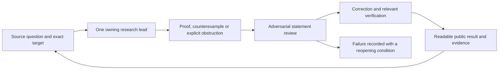

# How this research is organized

**Adopted 25 September 2026.** This protocol implements the owner's requested research architecture. It applies to this research programme. The three scientific records remain authoritative: [Wong coverage](https://github.com/Sodelin/Work-on-Samuel-Alexander-Research-/blob/codex/research-followup-2026-09-25/research/wong/completion/COVERAGE.md), [Alexander question ledger](QUESTION-LEDGER.md), and the [time/self-reference question ledger](https://github.com/Sodelin/Work-on-Samuel-Alexander-Research-/blob/codex/research-followup-2026-09-25/research/open-problems/time-self-reference/problem-ledger.json).

## People should be able to follow the mathematics

Every release should answer five questions in ordinary language:

1. What question did we ask, and where did it come from?
2. What can we now prove, compute, preserve or rule out?
3. What assumptions make the answer work?
4. What did the proof checker and the independent reviewer actually check?
5. What remains open, and why is the result useful even if the mathematics was already known?

A worked example or a small diagram comes before a wall of theorem names. Exact statements, source citations, proof code and reproducible evidence follow it.

## Roles and allocation

| Role | Model / reasoning | Responsibility | Work limit |
|---|---|---|---|
| Programme auditor and publisher | GPT-6 Astra / Ultra requested | Challenge statements, compare hypotheses and prior work, adjudicate findings, update public results | One specific claim per audit; no duplicate full implementation |
| Wong lead | GPT-6 Astra / Max | Complete the paper's mathematical and algorithmic coverage | One accepted deliverable at a time within the full-paper objective |
| Alexander connections lead | GPT-6 Astra / Max | Construct an actual transfer to Alexander's definitions, or prove the precise obstruction | One transfer or obstruction packet per cycle |
| General connections lead | GPT-6 Astra / Max | Address source-stated questions and bridges to other explicit models | One bridge across two defined models per cycle |
| Shared worker 1 | GPT-6 Sol / High | Proof implementation, or a sharply defined alternate construction | One assignment at a time |
| Shared worker 2 | GPT-6 Sol / High | Independent reconstruction, counterexamples, targeted source work or a side idea | One assignment at a time |
| Shared assistant | GPT-6 Luna / High | Receipt comparison, source inventories, link checks and release packaging | Mechanical checks with explicit inputs and outputs |

The coordinator can set other tasks' model overrides. Its own Ultra setting is selected in the application by the owner and is not certified by this document. Settings requested and actual successful execution are recorded separately. Extra agents are scheduled through the shared pool; each lead does not launch another full fleet. A freed worker may change roles, but a proof's author is not described as its independent reviewer.

## One bounded cycle

Before substantial work, save a short brief with the exact quantifiers, source location, dependencies, usefulness, next derivation, counterexample tests and finish condition. The auditor first receives the statement and dependencies so the critique can be independent of the author's preferred narrative.

An audit asks a concrete question: Is a hypothesis missing? Does the encoded statement match the paper? Does a counterexample break the proposed generalization? Does the result merely assume the difficult conclusion? What exact line fails in a deliberately invalid comparison model? Return a counterexample, corrected statement, dependency gap or explicit pass. Further testing needs a specific remaining risk.

Each work item ends with a proved statement, refutation, useful partial result or precisely described unresolved obligation. Reopening an exhausted route requires a new mechanism or new evidence. A side idea receives a short saved brief and may use a free Sol worker; it does not silently replace the owner's primary target.

## Three first-cycle deliverables

| Owner | Deliverable | Completion evidence |
|---|---|---|
| Wong | Integrate the 65 locally checked MRCA, interval and normal-form declarations with the existing real library; advance the separately owned count-process proof | Source correspondence, combined audit, exact hashes and hosted verification of the published code |
| Alexander | State and test one exact relationship between the finite feedback/observation results and Alexander's infinite ancestry hypotheses | A valid instantiated theorem or a counterexample identifying the failed hypothesis, including finite versus almost-sure distinctions |
| General connections | Develop one explicit preservation or information-loss statement in two models, using existing source work | Definitions, checked hypotheses, worked applications, prior-work comparison and a test of what would invalidate the interpretation |

A first cycle can be completed while a paper or broad source question remains open. There is no promise that all open research will be solved within one usage window.

## Evidence, originality and usefulness

These are separate judgments:

| Judgment | What establishes it |
|---|---|
| Mathematical correctness | A valid argument under stated assumptions; independent reconstruction adds evidence |
| Formal verification | The exact declaration passes the pinned proof checker with an audited dependency list |
| Source correspondence | The definitions, quantifiers and hypotheses match the cited claim |
| Novelty | Comparison with relevant prior work; absence from a small search is insufficient |
| Usefulness | A concrete inference, computation, preservation guarantee or invalid inference prevented |
| Empirical applicability | Evidence that the measurements and mechanisms satisfy the model's assumptions |

Formalizing a known result can be valuable: it makes assumptions inspectable and provides reusable components. A new counterexample can reveal why a tempting connection fails. Neither needs to be advertised as a breakthrough to be worth sharing. A mathematical bridge to biology remains conditional until its biological assumptions are justified.

## Publishing and handoff

The auditor is the single public integrator. Each accepted packet includes readable motivation, a worked example, an exact statement, provenance, proof status, a verification command or receipt, and limitations. Drafts and failed routes can be published with their actual labels.

[Research progress](RESEARCH-PROGRESS.md) is a dated navigation snapshot. It links to the owning ledgers and commit-specific evidence; it is not a second source of mathematical truth. The default README links to that snapshot and the active PR so progress cannot disappear on a branch.

Publish each substantive completed packet rather than waiting for every lane to finish. Update the front page after a release or meaningful change. A hosted check applies only to its exact commit and included modules. Local checks awaiting integration stay visibly local. Author email and VibeMathed updates are recorded separately from GitHub publication.

There is one local Lean compiler slot. Sources have one writer each. Failed platform calls are checkpointed, with bounded recovery rather than repeated loops. All completed, parked and handed-off tasks remain visible and unarchived.

## Method provenance

This adapts the owner's Collatz project's `RESEARCH_PROTOCOL_V2.md`: explicit theorem targets, adversarial controls, dependency gaps, failure records, separate correctness/priority/usefulness labels and artifact-based handoffs. It reuses those working practices; no claim about Collatz is imported into this programme.
