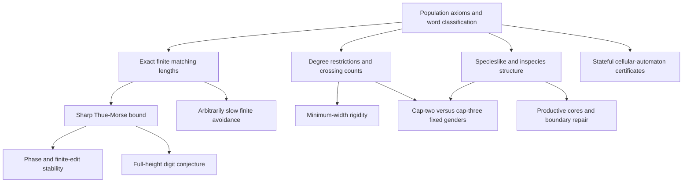

# Research map

Alexander's population axioms turn word realization into a graph question:
which infinite label sequences occur along a path in every eligible infinite
population? His [2013 positive theorem](https://arxiv.org/html/1212.0186v2)
covers eventually periodic words. The separate
[classification manuscript](https://github.com/avg-netizen/biological-unavoidability)
gives an explicit avoiding graph for every other target. This notebook uses
that graph to ask quantitative and structural follow-on questions.

| Branch | What the proof pass establishes | Next substantial question |
|---|---|---|
| Quantitative avoidance | Sharp phase-zero bound and equality set; exact baseline first hits; real coefficient optimality; finite-edit and phase stability. | Prove or refute the complete digit/valuation formula for every height. |
| Quantitative aperiodicity | For every function, a constructed aperiodic target has larger actual finite maxima along increasing starts. | Derive useful upper rates from a concrete modulus of nonperiodicity. |
| Critical degree | Full infinite conservation and triangular minimum crossing width; binary equality rigidity and fixed-gender universality. | General-$k$ rigidity and a finite update description of larger-width tails. |
| Permanent genders | A productive inspecies core avoids each prescribed aperiodic binary word with cap three. | Decide whether cap two is sufficient or find a target requiring three. |
| Species interfaces | General finite/cofinite IAP and inspecies criteria, exact root-cone criterion, and consecutive-layer universality. | Productive-core behavior in arbitrary clusters and finite label-boundary repairs. |
| Observation interfaces | Indexed paths survive erasure but cannot always be recovered; history projection and exact observation/prediction criteria. | Identify specific models whose lineage and observation maps satisfy these interfaces. |
| Cellular automata | Static weighted-mix comparisons, including actual real convex hulls. | A valid stateful local-rule certificate that strictly improves a known same-rule static bound. |

The [ten proposals](TEN-RESEARCH-IDEAS.md) state these targets precisely, with
checked seeds and decisive tests. [FORMALIZATION.md](FORMALIZATION.md) records
the exact Lean statements. The positive binary theorem and arbitrary real-date
model bridges are now checked, so they no longer occupy the research gap list.
General finite-alphabet positive proofs and full CA dynamics remain outside
the package.

The [prior-work audit](PRIOR-WORK-AUDIT.md) and
[older-construction comparison](notes/OLDER-CONSTRUCTIONS-AND-RANK-AUDIT.md)
matter mathematically: inspecies/cofinite-descendant and multiple-root cone
phenomena already appear in Alexander's work. His 2013 Section 6 also points
to forbidden-subtree universality and graph-rank theory. The claims worth
reviewing here concern narrower quantitative, uniform-cap and simultaneous
preservation statements, not discovery of those broad connections.

The [full-height conjecture](research/thue-morse/FULL-HEIGHT-CONJECTURE.md)
illustrates the evidence boundary: exact finite computations can falsify it,
but passing them does not certify all indices. Its candidate evaluator remains
research code until its actual graph identities are proved.

For review, start with the [handoff](HANDOFF-FOR-ALEXANDER.md),
[question ledger](QUESTION-LEDGER.md), [status](STATUS.md), and
[reproduction guide](REPRODUCE.md). The broader emergence discussion is kept
in the [exploratory appendix](explorations/COMPLEX-SYSTEMS-INTERFACE.md), where
specific models and maps still need to be supplied. These graph results do
not classify empirical species or establish biological inheritance models.
