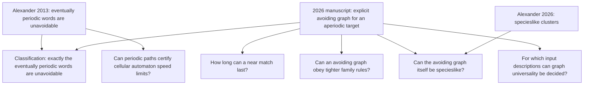

# Research map: from unavoidable paths to testable questions

This page is the short route through the core project. It explains why each question was chosen, what it inherits from earlier work, what is established here, and what would count as progress. For exact statements and verification limits, follow the linked notes and [status table](STATUS.md). The [complex-systems interface note](explorations/COMPLEX-SYSTEMS-INTERFACE.md) is a separate exploratory appendix.

## The starting problem

Imagine an infinite family tree drawn as a directed graph. A vertex is born after its parents; only finitely many vertices can be born before any given time. There are finitely many roots, and each nonroot has a parent of each required gender. A path follows parent-to-child edges through successive generations. A binary sequence such as `010010...` is **unavoidable** if *every* graph satisfying the axioms contains an infinite path whose successive parent labels spell that sequence. The graphs and labels are mathematical objects; the name is a metaphor, not a biological prediction. The exact population axioms and the distinction between genders on edges and genders fixed on vertices matter in the variants below. [Alexander 2013, Definition 1 and Proposition 5](https://www.combinatorics.org/ojs/index.php/eljc/article/view/v20i1p31); [degree-boundary model](notes/DEGREE-BOUNDARY.md).

An **eventually periodic** sequence repeats a finite block after some starting segment; `00101010...` is an example. Alexander proved in 2013 that these sequences are unavoidable. The [2026 classification manuscript](https://github.com/avg-netizen/biological-unavoidability) supplies the converse: every sequence that is *not* eventually periodic has a population avoiding it. Together these results characterize the unavoidable sequences. The classification repository reports a Lean endpoint for the new avoiding construction and states the limits of that formalization in its [statement audit](https://github.com/avg-netizen/biological-unavoidability/blob/main/STATEMENT-AUDIT.md). This repository builds on those results; it does not claim them as its own.



These branches share a theme: the classification settles whether an infinite match exists under the original axioms; they ask for quantitative, structural, applied, and algorithmic refinements. They are separate mathematical problems. A result in one branch does not silently solve another.

## What we are trying to learn

| Branch and source | Precise question | Why it is useful | Current answer | Best next step |
|---|---|---|---|---|
| [Near matches in the Thue–Morse graph](notes/THUE-MORSE-PATHS.md). Uses the manuscript's explicit graph and recursively defined Thue–Morse bits. | Starting at vertex `v`, how many initial labels can a path match before every continuation fails? | The classification says an infinite match fails. The exact finite maximum measures *how* it fails and reveals dyadic structure. | For `v≥1`, [Lean proves](lean/SamuelAlexanderResearch/SharpThueMorse.lean) `3L(v)≤8v−1`, existence of `L(v)`, and equality exactly at `v=3·2^n−1` with `L(v)=8·2^n−3`. | Seek independent external proof review and an earlier equivalent result under another name; see the [prior-work audit](PRIOR-WORK-AUDIT.md). |
| [Degree and gender restrictions](notes/DEGREE-BOUNDARY.md). Uses Alexander's population axioms and distinguishes edge labels from permanent vertex genders. | What child caps are possible? Does every aperiodic binary target still have an avoiding graph with permanent genders and at most two children per vertex? | The count rules out impossible regimes before a construction is attempted. | [Graph-level Lean proofs](lean/SamuelAlexanderResearch/PopulationCounting.lean) rule out `d<k` with finite roots in the natural-date model and prove the two-child gender-balance constraint. The **two-child fixed-gender avoidance** question remains open here. | Investigate a construction or obstruction; the [coverage report](FORMALIZATION.md) states the real-date and infinite critical-degree gaps. |
| [Specieslike-cluster bridge](notes/SPECIESLIKE-BRIDGE.md). Compares `P_s` with Alexander's [2013 inspecies](https://arxiv.org/html/1201.2869) and [2026 cluster](https://arxiv.org/html/2602.05274v1) work. | Can the same graph both avoid a target word and satisfy whole-graph specieslike axioms? What changes under common ancestry or fixed vertex genders? | It tests a precise cross-paper interface and separates graph ancestry from biological interpretation. | [Lean checks](lean/SamuelAlexanderResearch/SpeciesBridge.lean) whole-graph specieslikeness and [exactly two maximal four-property cones](lean/SamuelAlexanderResearch/SpeciesCones.lean). Earlier papers already contain the general cofinite-descendant and multiple-cone patterns. A [connected fixed-gender repair](notes/FIXED-GENDER-SPECIESLIKE.md) is written, not Lean checked. | Examine label coverage within maximal cones and seek review of the fixed-gender repair. The [audit](PRIOR-WORK-AUDIT.md) gives exact source comparisons. |
| [Periodic lifelines in cellular automata](notes/PERIODIC-LIFELINE.md). Uses Alexander's 2013 cellular-automaton application and compares known [spaceship bounds](https://arxiv.org/abs/1203.1644). | Can a local rule guarantee two distinct types of live predecessor, and what does that imply about moving patterns? | It connects an abstract unavoidable path to local rule certificates. It also tests which apparent speed bounds add information. | A conditional reduction and finite toy checker are written. Constant-label paths give a **stronger** spaceship velocity bound than the alternating path from the same static certificate. There is no new sharp rule-specific result or Lean proof. | Test whether a stateful or phase-sensitive certificate can beat the static convex-hull intersection; compare with known bounds. |
| [Automatic-sequence inputs](notes/AUTOMATIC-SEQUENCES.md). Combines a criterion in the 2026 manuscript with [decidability of automatic-sequence eventual periodicity](https://arxiv.org/abs/0808.1657). | If a finite automaton describes the target `s`, can we decide whether the particular graph `P_s` realizes every binary infinite sequence? | It identifies an input class where an otherwise difficult graph property has an algorithmic decision route. | **Yes, as a direct corollary of cited results:** `P_s` is universal exactly when `s` is eventually periodic, and the latter is decidable for automatic `s`. We have no implementation or Lean formalization. | Give an explicit, independently checked algorithm if the computational direction proves interesting. |

### 1. Near matches: a sharp finite theorem

The Thue–Morse word begins `011010011001...`; its bit at index `n` is the parity of the number of `1` bits in `n`. For the [exact graph and indexing](notes/THUE-MORSE-PATHS.md), let `L(v)` be the greatest number of initial Thue–Morse labels a path starting at numbered vertex `v` can match. The classification rules out an infinite match. The [new Lean development](lean/SamuelAlexanderResearch/SharpThueMorse.lean) proves that a finite maximum exists and that

```text
3 L(v) <= 8v - 1  for every v >= 1.
```

The same module proves that equality holds **exactly** at starts `v=3·2^n−1`, with `L(v)=8·2^n−3`. It defines the actual digit-parity word, checks the classification graph's missing `0→1` edge, identifies its labels with the proof's graph, and proves a bound for every actual finite matching-path prefix. The argument follows the two endpoints of the reachable interval and proves their coalescence using dyadic Thue–Morse identities. The earlier quadratic bound and finite scans remain historical steps in the [research note](notes/THUE-MORSE-PATHS.md); the scans corroborate but are not premises of the proof. The [formalization coverage](FORMALIZATION.md) and [statement review](verification/STATEMENT-REVIEW.md) explain its scope. Whether this sharp formula appears elsewhere in a different language remains a [bounded prior-work question](PRIOR-WORK-AUDIT.md).

### 2. Degree boundary: where a change of model matters

With `k` required incoming labels and a cap of `d` children per vertex, counting edges in a finite birthdate prefix of `N` vertices and `R_N` roots gives `(k-d)N <= kR_N`. If `d<k` and the whole population has finitely many roots, this forbids an infinite population. The binary edge-labelled avoiding graph in the classification sits at the threshold `d=k=2`. When gender must instead belong permanently to a *vertex*, its published lift permits four children per vertex. A two-child fixed-gender avoiding graph, if one exists for every aperiodic target, needs a different argument. The necessary balance `|M_N-F_N| <= R_N` is a constraint, not an existence proof.

The [PopulationCounting Lean module](lean/SamuelAlexanderResearch/PopulationCounting.lean) now derives finite edge counts and the subcritical impossibility from an actual naturally ordered graph with functional labels. It also proves the gender-balance inequality from permanent vertex genders. The previous arithmetic-only [DegreeBounds module](lean/SamuelAlexanderResearch/DegreeBounds.lean) remains as a simpler layer. The [formalization scope](FORMALIZATION.md) keeps two gaps visible: arbitrary real birthdates are not reduced to a natural enumeration in Lean, and the **two-child fixed-gender avoiding construction** is still unknown here. A different [written repair](notes/FIXED-GENDER-SPECIESLIKE.md) makes the manuscript's existing four-child gender lift connected and specieslike; it does not lower its child cap to two.

### 3. Specieslike clusters: a direct intersection of papers

Alexander's [2026 specieslike paper](https://arxiv.org/html/2602.05274v1) asks whether **sets of vertices** in a birthdated parenthood graph satisfy ancestry-based cluster axioms. The [Lean bridge](lean/SamuelAlexanderResearch/SpeciesBridge.lean) calculates exact strict reachability in the classification's avoiding graph `P_s`: every vertex reaches all sufficiently late vertices. It checks connectedness, convexity, reflection, natural-date biosphere axioms, and whole-graph specieslikeness. The [cone module](lean/SamuelAlexanderResearch/SpeciesCones.lean) proves that adding common ancestry and reflection gives exactly two maximal clusters, one per root.

The [prior-work audit](PRIOR-WORK-AUDIT.md) places those facts carefully. Alexander's [2013 inspecies Proposition 6](https://arxiv.org/html/1201.2869) already implies cofinite descendants after we show that `P_s` is an inspecies, and his 2026 Example 14(1) already has a multiple-root cone pattern. The two-cone count here is graph-specific. A sharper comparison is that his earlier example has strictly consecutive generations and, under any valid binary labelling, realizes every binary word; `P_s` has skip edges and can avoid an aperiodic target. The [generalization note](notes/SPECIESLIKE-GENERALIZATION.md) proves that comparison and an exact IAP criterion, and gives counterexamples to weaker shortcuts. The **whole** graph has two roots and no common ancestor; its maximal common-ancestor cones lose a required parent label at their boundary. This mathematical bridge does not classify real species.

### 4. Cellular automata: an application with a clear test

Alexander already used unavoidable paths to bound how fast a pattern can move in certain cellular automata. Our [lifeline note](notes/PERIODIC-LIFELINE.md) asks for an explicit local certificate: whenever a new cell is live, can the local rule identify *two distinct* live predecessors, one of type `A` and one of type `B`? If so, Alexander's periodic-path theorem supplies `ABAB...`, `AAAA...`, and `BBBB...` lifelines in any nonextinct finite-start evolution. For a finite-support spaceship, all infinite lifelines have its velocity. If the allowed parent-to-child displacement sets are `D_A` and `D_B`, the constant paths force that velocity into `conv(D_A) ∩ conv(D_B)`, a stronger bound than the alternating-path polygon `(conv(D_A)+conv(D_B))/2`. This means the original idea of sharpening speed limits using the alternating polygon alone does not work. The finite checker verifies a proposed certificate for a fully specified local rule, but the toy rule yields no new bound. A worthwhile next step would need additional state or phase information that couples successive steps, followed by comparison with prior speed results.

### 5. Automatic inputs: a small decidable island

The classification manuscript also analyzes **its particular target-dependent graph** `P_s`. It states that `P_s` realizes *every* binary infinite sequence exactly when `s` is eventually periodic. For an automatic sequence given by a finite automaton with output, eventual periodicity is decidable by a known theorem. Combining the two gives a decision method for universality of this `P_s` family. This is a corollary, with no new algorithm implemented here.

Two quantifiers are easy to confuse: “`s` is unavoidable” means **every eligible population** has a path spelling `s`; “`P_s` is universal” means **this one constructed population** has paths spelling **every binary sequence**. The corollary concerns the second question under the finite-automaton input restriction. It does not decide arbitrary population graphs or arbitrary computable sequences.

## How to read the evidence

- **Established source result:** attributed to the published 2013 paper, the 2026 manuscript, or other cited work. Our [source ledger](SOURCES.md) identifies the exact inputs; its hashes identify the local files read.
- **Written proof here:** an argument exposed for review. The [fixed-gender specieslike repair](notes/FIXED-GENDER-SPECIESLIKE.md), generic [IAP characterization](notes/SPECIESLIKE-GENERALIZATION.md), and conditional lifeline reduction have this status; their broader priority is unestablished.
- **Directly inherited result:** Alexander's 2013 inspecies proposition implies cofinite descendants once `P_s` is shown to be an inspecies. His 2026 example anticipates the multiple-root cone pattern. The [claim-by-claim audit](PRIOR-WORK-AUDIT.md) separates those precedents from our graph-specific deductions.
- **Lean checked:** the pinned [formalization package](FORMALIZATION.md) compiles actual graph counting, binary avoidance, the specieslike bridge, exact cones, and the sharp Thue–Morse bound. The [endpoint audit](verification/FORMALIZATION-RECEIPT.md) lists assumptions and proof dependencies. It does not formalize the 2013 positive theorem or every general real-date claim.
- **Exact finite check:** a program exhausts a stated finite domain. It can disprove a universal formula by finding a valid counterexample, but a clean finite range is evidence only.
- **Conjecture or open question here:** no proof in this repository. The two-child fixed-gender avoidance problem and label-coverage repair inside maximal cones have this status. "Open here" does not assert novelty or that the literature has no answer. See the [search log](research/PRIOR-WORK-SEARCH-2026-09-24.md).

## A practical route for contributors and readers

1. Read this page and the [short handoff](HANDOFF-FOR-ALEXANDER.md). The [status table](STATUS.md) gives exact boundaries if a claim sounds stronger than intended.
2. For a proof effort, check the [formalization scope](FORMALIZATION.md), [prior-work audit](PRIOR-WORK-AUDIT.md), and [bounded task briefs](TASKS/). The sharp path and natural-date counting briefs now record solved results and remaining generalizations. A valid counterexample to a live conjecture is as valuable as a proof.
3. For an application effort, propose a fully specified cellular-automaton rule, a local certificate, and the prior speed bound being improved. For an algorithm effort, specify the automaton input format and the exact question being decided.
4. When sending a result, state what is proved, what was computed, which source lemmas were used, and how to reproduce checks. The [provenance note](PROVENANCE.md) records the AI-assisted workflow; the [reproduction guide](REPRODUCE.md) has commands.

The sharp Thue–Morse and natural-date graph-counting tasks are now checked. The most focused next mathematical questions are the **two-child fixed-gender avoiding construction**, the **incoming-label boundary of maximal common-ancestor cones**, and whether the sharp path formula already occurs in earlier word or graph literature. The [fixed-gender specieslike repair](notes/FIXED-GENDER-SPECIESLIKE.md) is a written result worth independent review before it is formalized or highlighted as a contribution.

The broader question about emergence in cells or social systems is recorded in an [exploratory appendix](explorations/COMPLEX-SYSTEMS-INTERFACE.md). It is not part of the core claim table until a specific state-to-lineage map passes an axiom check.
