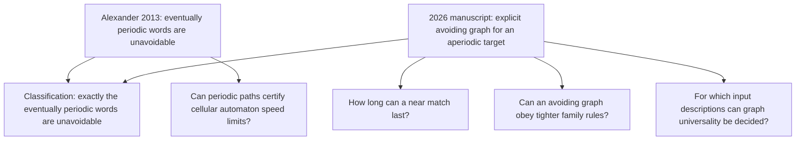

# Research map: from unavoidable paths to four testable questions

This page is the short route through the project. It explains why each question was chosen, what it inherits from earlier work, what is established here, and what would count as progress. For exact statements and verification limits, follow the linked notes and [status table](STATUS.md).

## The starting problem

Imagine an infinite family tree drawn as a directed graph. A vertex is born after its parents; only finitely many vertices can be born before any given time. There are finitely many roots, and each nonroot has a parent of each required gender. A path follows parent-to-child edges through successive generations. A binary sequence such as `010010...` is **unavoidable** if *every* graph satisfying the axioms contains an infinite path whose successive parent labels spell that sequence. The graphs and labels are mathematical objects; the name is a metaphor, not a biological prediction. The exact population axioms and the distinction between genders on edges and genders fixed on vertices matter in the variants below. [Alexander 2013, Definition 1 and Proposition 5](https://www.combinatorics.org/ojs/index.php/eljc/article/view/v20i1p31); [degree-boundary model](notes/DEGREE-BOUNDARY.md).

An **eventually periodic** sequence repeats a finite block after some starting segment; `00101010...` is an example. Alexander proved in 2013 that these sequences are unavoidable. The [2026 classification manuscript](https://github.com/avg-netizen/biological-unavoidability) supplies the converse: every sequence that is *not* eventually periodic has a population avoiding it. Together these results characterize the unavoidable sequences. The classification repository reports a Lean endpoint for the new avoiding construction and states the limits of that formalization in its [statement audit](https://github.com/avg-netizen/biological-unavoidability/blob/main/STATEMENT-AUDIT.md). This repository builds on those results; it does not claim them as its own.



The four branches share a theme: the classification settles whether an infinite match exists under the original axioms; they ask for quantitative, structural, applied, and algorithmic refinements. They are separate mathematical problems. A result in one branch does not silently solve another.

## What we are trying to learn

| Branch and source | Precise question | Why it is useful | Current answer | Best next step |
|---|---|---|---|---|
| [Near matches in the Thue-Morse graph](notes/THUE-MORSE-PATHS.md). Uses the 2026 paper's explicit graph and the classical [overlap-free property](https://igm.univ-mlv.fr/~berstel/Articles/1993OverlapFree.pdf). | Starting at vertex `v`, how many initial Thue-Morse labels can a path match before every continuation fails? | The classification says the infinite match fails. A length bound measures *how* it fails and may expose the substitution structure behind the construction. | A written proof gives a quadratic upper bound for every `v`. Two exact finite methods suggest a much sharper linear bound. The linear formula is **unproved**. | Prove or refute the [sharp-bound challenge](TASKS/THUE-MORSE-SHARP-BOUND.md), then seek independent proof review and, if valuable, Lean formalization. |
| [Degree and gender restrictions](notes/DEGREE-BOUNDARY.md). Uses Alexander's graph axioms and compares the 2026 paper's edge-labelled graph with its fixed-vertex-gender lift. | What is the smallest possible child cap? Does every aperiodic binary target still have an avoiding graph if each vertex has a permanent gender and at most two children? | It tests whether the classification survives a more restrictive meaning of “family.” A sharp necessary bound guides any attempted construction. | A direct count rules out child cap `d<k` for `k` required labels and finitely many roots; at the binary two-child boundary, birth-prefix gender counts must stay within the root count. The fixed-gender avoidance question is **unresolved here**. Lean checks only arithmetic consequences from explicit counting premises. | Complete the [graph-level Lean challenge](TASKS/DEGREE-BOUNDARY-LEAN.md); independently seek a two-child construction or obstruction. |
| [Periodic lifelines in cellular automata](notes/PERIODIC-LIFELINE.md). Uses Alexander's 2013 cellular-automaton application and compares known [spaceship bounds](https://arxiv.org/abs/1203.1644). | Can a local rule guarantee two distinct types of live predecessor, forcing a path with alternating step restrictions? | Such a path can bound the velocity of a repeating moving pattern through a finite polygon of permitted steps. This is a possible application of the abstract theorem to an explicit rule. | A conditional reduction and velocity-polygon proof are written. A finite checker works on a toy rule. There is **no new sharp rule-specific speed limit** or Lean proof. | Find a concrete rule for which the certificate improves an existing bound, checking geometric and published bounds first. |
| [Automatic-sequence inputs](notes/AUTOMATIC-SEQUENCES.md). Combines a criterion in the 2026 manuscript with [decidability of automatic-sequence eventual periodicity](https://arxiv.org/abs/0808.1657). | If a finite automaton describes the target `s`, can we decide whether the particular graph `P_s` realizes every binary infinite sequence? | It identifies an input class where an otherwise difficult graph property has an algorithmic decision route. | **Yes, as a direct corollary of cited results:** `P_s` is universal exactly when `s` is eventually periodic, and the latter is decidable for automatic `s`. We have no implementation or Lean formalization. | Give an explicit, independently checked algorithm if the computational direction proves interesting. |

### 1. Near matches: the most concrete proof puzzle

The Thue-Morse word begins `011010011001...`; its bit at index `n` is the parity of the number of `1` bits in `n`. For the [exact graph and indexing](notes/THUE-MORSE-PATHS.md), let `L(v)` be the greatest number of initial Thue-Morse labels a path starting at numbered vertex `v` can match. The classification proves that each `L(v)` is finite. Our written argument uses the word's overlap-freeness to prove

```text
L(v) <= (v + 1)(v + 6)/2  for every v >= 0.
```

That proof is a deduction in this repository, subject to independent mathematical review; it is not Lean checked. Exact searches found no counterexample, for `1 <= v < 131072`, to the stronger proposal `3 L(v) <= 8v - 1`. They also suggest equality at `v = 3·2^n - 1`. No finite search establishes either infinite statement. The [challenge brief](TASKS/THUE-MORSE-SHARP-BOUND.md) pins the missing `0 -> 1` edge, indexing, desired proof or counterexample, and acceptance checks. This is the best bounded task for a stronger proof model or a mathematician who enjoys word combinatorics.

### 2. Degree boundary: where a change of model matters

With `k` required incoming labels and a cap of `d` children per vertex, counting edges in a finite birthdate prefix of `N` vertices and `R_N` roots gives `(k-d)N <= kR_N`. If `d<k` and the whole population has finitely many roots, this forbids an infinite population. The binary edge-labelled avoiding graph in the classification sits at the threshold `d=k=2`. When gender must instead belong permanently to a *vertex*, its published lift permits four children per vertex. A two-child fixed-gender avoiding graph, if one exists for every aperiodic target, needs a different argument. The necessary balance `|M_N-F_N| <= R_N` is a constraint, not an existence proof.

The [Lean module](lean/SamuelAlexanderResearch/DegreeBounds.lean) currently proves arithmetic implications **given** the edge-count inequalities. It does not derive them from a formal graph. The [formalization scope](notes/FORMALIZATION-SCOPE.md) and [Lean challenge](TASKS/DEGREE-BOUNDARY-LEAN.md) make that missing step explicit. Completing it would make the elementary observation machine checked end to end; it would still leave the separate two-child avoidance question open.

### 3. Cellular automata: an application with a clear test

Alexander already used unavoidable paths to bound how fast a pattern can move in certain cellular automata. Our [lifeline note](notes/PERIODIC-LIFELINE.md) asks for an explicit local certificate: whenever a new cell is live, can the local rule identify *two distinct* live predecessors, one of type `A` and one of type `B`? If so, Alexander's periodic-path theorem supplies an infinite `ABAB...` lifeline in any nonextinct finite-start evolution. If the allowed parent-to-child displacement sets are `D_A` and `D_B`, a spaceship velocity must lie in `(conv(D_A)+conv(D_B))/2`. This conditional proof is written in the note. The finite checker verifies proposed certificates for fully specified local rules, but the toy rule does not improve a known bound. A worthwhile next result needs a specific rule and a comparison with prior speed results.

### 4. Automatic inputs: a small decidable island

The classification manuscript also analyzes **its particular target-dependent graph** `P_s`. It states that `P_s` realizes *every* binary infinite sequence exactly when `s` is eventually periodic. For an automatic sequence given by a finite automaton with output, eventual periodicity is decidable by a known theorem. Combining the two gives a decision method for universality of this `P_s` family. This is a corollary, with no new algorithm implemented here.

Two quantifiers are easy to confuse: “`s` is unavoidable” means **every eligible population** has a path spelling `s`; “`P_s` is universal” means **this one constructed population** has paths spelling **every binary sequence**. The corollary concerns the second question under the finite-automaton input restriction. It does not decide arbitrary population graphs or arbitrary computable sequences.

## How to read the evidence

- **Established source result:** attributed to the published 2013 paper, the 2026 manuscript, or other cited work. Our [source ledger](SOURCES.md) identifies the exact inputs; its hashes identify the local files read.
- **Written proof here:** a mathematical argument exposed for review. The quadratic bound, edge counts, and conditional lifeline reduction have this status. Their broader priority has not been established.
- **Lean checked:** the [pinned module](lean/SamuelAlexanderResearch/DegreeBounds.lean) and [CI workflow](.github/workflows/verify.yml) compile the *encoded arithmetic statements*. Lean does not currently check the four research lines end to end.
- **Exact finite check:** a program exhausts a stated finite domain. It can disprove a universal formula by finding a valid counterexample, but a clean finite range is evidence only.
- **Conjecture or open question here:** no proof in this repository. “Open here” does not assert novelty or that the literature has no answer. See the [search log](SEARCH-LOG.md).

## A practical route for contributors and readers

1. Read this page and the [short handoff](HANDOFF-FOR-ALEXANDER.md). The [status table](STATUS.md) gives exact boundaries if a claim sounds stronger than intended.
2. For a proof effort, choose one of the two [bounded task briefs](TASKS/THUE-MORSE-SHARP-BOUND.md) or [Lean briefs](TASKS/DEGREE-BOUNDARY-LEAN.md). A valid counterexample is as valuable as a proof.
3. For an application effort, propose a fully specified cellular-automaton rule, a local certificate, and the prior speed bound being improved. For an algorithm effort, specify the automaton input format and the exact question being decided.
4. When sending a result, state what is proved, what was computed, which source lemmas were used, and how to reproduce checks. The [provenance note](PROVENANCE.md) records the AI-assisted workflow; the [reproduction guide](REPRODUCE.md) has commands.

The most promising immediate mathematical puzzle is the proposed linear Thue-Morse bound. The most useful formalization task is to close the graph-counting gap in Lean. Neither needs to hold up the other branches.
