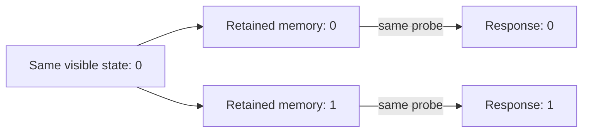

# When the same appearance can hide a different future

**Start here for the time and self-reference research.** This is a separate
track within the ancestry repository, continued on 27 September 2026 UTC.
**None of the source paper's full questions is declared solved.**

## What the paper asks

Abramsky, Levin and their coauthors ask how living systems remember, anticipate,
change their rules, and remain coherent while their components change. Their
[Royal Society paper](https://doi.org/10.1098/rsos.261059) distinguishes physical
unfolding from a system's representation of past and possible futures. It also
asks what a simplified description loses and how sparse observations can test
models with many possible histories. Our twelve ledger entries are a working
decomposition of that agenda, not twelve verbatim author conjectures.

## What we established

For a **specified deterministic model**, visible output and intervention set,
two states can share one exact predictive description precisely when every
allowed finite intervention sequence gives the same visible result. Grouping
states this way gives the coarsest exact predictive state. In our invented
memory example, one retained bit beyond the visible bit suffices for arbitrary
histories; no fixed window of recent history always replaces it.

For a **specified stochastic model**, we proved the exact condition under
which a reduced state preserves transition probabilities. With the matching
initial distribution and observation map, it preserves complete finite
observation-and-action histories, even when randomized interventions adapt
to earlier observations. Noisy measurements are covered through a joint
state/measurement law that can include correlated noise.

We also proved a limit: two states can predict exactly the same visible
histories at **every finite horizon**, yet merging them can fail to preserve
the actual state transitions. No randomized test of those recorded histories
separates them. Predicting outputs and retaining exact dynamics are different
requirements. These results reuse established mathematics; **Lean checks the
proofs against explicit assumptions**, not the truth of a biological model.

## Why it helps with biology

The work sharpens three questions: **what must be retained, which intervention
exposes it, and what evidence identifies its cause?**

The diagram is invented mathematics. A fitted prediction is a separate
evidence level; identifying a biological storage mechanism needs measurements
and interventions. A predictive history effect can also reveal permanent
differences between cells. Selecting cells by a later visible state can create
a misleading effect even after randomized history assignment.

The [Stentor evidence contract](research/open-problems/time-self-reference/predictive-memory/STENTOR-EVIDENCE.md)
connects a primary study's distinct probes and molecular perturbations to a
specific next test: assigned, time-matched histories, a common probe, linked
cell/lineage records, and complete selection accounting. The checked public
data routes do not yet establish the records needed to identify that contrast.
The [biology note](research/open-problems/time-self-reference/predictive-memory/BIOLOGY.md)
also connects the question to Levin's planarian work.

There is a useful geometry connection: in the stochastic example, one state's
predictions are exactly the midpoint of two others' predictions. This shows
how a mixture of response programs can mimic an internal random transition.
It is geometry of predictions; a geometry of tissue or morphogenesis still
needs biological variables, measurements and an explicit correspondence.

## Does this connect to ancestry?

For a proved operation, yes: simplifying ancestry to an original sample set
commutes with later destructive restrictions to its subsets. The mapping is
instantiated in the finite genomic-ancestry model. Adding samples can require
discarded information. Another proved limit shows that exact finite edges and
paths cannot determine a specified infinite-population ancestry property over
all admissible completions. These are graph results. A mapping of Wong's full
stochastic generator, its clocks and observations remains unproved.

## What remains open, and where to read next

Time, self-reference, changing decision makers, semantic change and biological
mechanisms remain broader open questions. The next mathematical gate is a
quantified approximation bound when stochastic preservation is imperfect;
the next evidence gate is a justified biological observation/intervention
model. The general rare-observation testing theorem still needs formalization.

Read the [deterministic results](research/open-problems/time-self-reference/predictive-memory/RESULTS.md),
[stochastic theorem and counterexamples](research/open-problems/time-self-reference/predictive-memory/STOCHASTIC.md),
and [source-to-result audit](research/open-problems/time-self-reference/predictive-memory/AUDIT.md).
The [verification receipt](research/open-problems/time-self-reference/predictive-memory/verification/PROOF-RECEIPT.json)
identifies checked inputs; the [canonical ledger](research/open-problems/time-self-reference/problem-ledger.json)
keeps the full questions and remaining gates visible.
