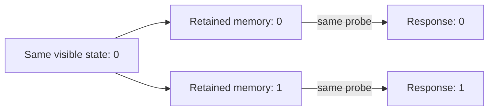

# When the same appearance can hide a different future

**Start here for the time and self-reference research.** This is a separate
track within the ancestry repository. Verified continuation, 27 September 2026 UTC. **None of the source paper's full questions is declared solved.**

## What the paper asks

Abramsky, Levin and their coauthors ask how living systems remember, anticipate,
change their rules, and remain coherent while their components change. Their
[Royal Society paper](https://doi.org/10.1098/rsos.261059) distinguishes physical
unfolding from a system's representation of past and possible futures. It also
asks what a simplified description loses and how sparse observations can test
models with many possible histories. Our twelve ledger entries are a working
decomposition of that agenda, not twelve verbatim author conjectures.

## What we established

The central mathematical result concerns a **specified deterministic model**,
a specified visible output, and specified allowed interventions:

> Two states may share one predictive description exactly when every permitted
> finite intervention sequence gives the same visible result. Grouping states
> this way gives the coarsest exact predictive state. Every other exact model
> that retains the visible output must retain at least these distinctions.

This extends the earlier next-step criterion into a general description of how
to repair lost information. It reuses established mathematics of behavioral
equivalence and machine minimization; it is not a claim to have discovered that
theory. We encode the statements and proofs in **Lean**, which checks that the
conclusions follow from the stated assumptions.

In the worked model, a visible bit and one retained memory bit suffice even
when the detailed history grows without bound. The full history and an
irrelevant changing bit may be discarded. Four predictive states are necessary
and attainable. A fixed window of recent history cannot always replace the
memory bit. These statements cover arbitrary finite histories and all future
horizons, rather than only the short examples previously tested.

## Why it helps with biology

It makes three questions precise: **what distinction must a model retain,
which intervention exposes it, and what evidence identifies its cause?** The
diagram is invented mathematics. A model fitted to measured responses is a
different kind of evidence. An experimentally supported storage mechanism
requires biological measurements and interventions.

A predictive history effect can arise from permanent differences between
cells. Our counterexamples show this exactly, including a case where selecting
cells by their later visible state creates a misleading effect despite initial
randomization. The [biology note](research/open-problems/time-self-reference/predictive-memory/BIOLOGY.md)
states the evidence needed to distinguish these explanations and connects the
question to published cellular and planarian work.

## Does this connect to ancestry?

Yes, for a precisely proved operation: simplifying ancestry to an original
sample set commutes with subsequent destructive restrictions to its subsets.
The mapping is instantiated in the repository's finite genomic-ancestry model.
Adding new samples can require information that was discarded. A separate
proved consequence shows that even exact finite old edges and ancestry paths
cannot determine a specified infinite-population ancestry property across
admissible completions. These are graph results, not a biological species test
or a proof about the complete stochastic ARG generator.

## What remains open, and where to read next

The source's broader claims about time, self-reference, semantic change,
changing decision makers and biological mechanisms remain open. The next
mathematical gate is a stochastic, intervention-preserving version tied to a
specified biological observation process; the next evidence gate is data that
separate changing state from stable type and selection.

Read the [precise results and proof route](research/open-problems/time-self-reference/predictive-memory/RESULTS.md),
[source-to-result audit](research/open-problems/time-self-reference/predictive-memory/AUDIT.md),
and [verification receipt](research/open-problems/time-self-reference/predictive-memory/verification/PROOF-RECEIPT.json).
The [canonical problem ledger](research/open-problems/time-self-reference/problem-ledger.json)
keeps the full questions and remaining gates visible.
