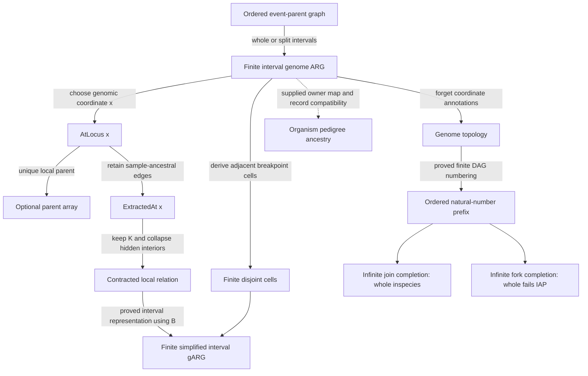

# Wong–Alexander connection outline

The formal connection now has three distinct outputs: exact ancestry-preserving transformations of finite genome graphs, a proof that a finite genome DAG admits incompatible infinite species outcomes, and a conditional projection into a supplied organism pedigree. Keeping those outputs separate makes the result useful without claiming that finite genomic data already determines an infinite biosphere.

The companion [machine-readable connection map](research/wong/connection-map.json) records exact input and output types, hypotheses, functions, theorem names, preserved information, missing information, and source locations. It is an inventory of mathematical definitions and proofs. Some definitions use classical choice; it is not a runnable genomic importer or an implementation of tskit.

## The source-grounded path through the paper

The finite genome-ARG input follows [Wong et al. (2024), journal page 2](https://doi.org/10.1093/genetics/iyae100): finite genome nodes, selected samples, a DAG and genomic interval annotations. The formal representation permits generic linearly ordered coordinates and proper half-open intervals. It keeps sample support, unique local parents, and canonical record grouping as visible conditions rather than silently deriving them from an arbitrary DAG.

| Stage | Exact checked connection | Main endpoint |
| --- | --- | --- |
| Ordered event parents → interval records | Full-span single-parent inheritance and left/right crossover routing become actual gARG records with the same topology and fixed-locus edges. Full classical event metadata and binary child arity are separate. | `WongEventEncoding.EventGraph.encoded_atLocus` |
| gARG → fixed-locus ancestry | Every local path is topologically sound and acyclic. | `WongGARG.GARG.locus_path_topology` |
| Local edges → parent array | Under `UniqueParentAt x`, an `Option Node` array preserves every local edge, node identity, and unary node. | `WongGARG.GARG.local_parent_representation` |
| Local edges → sample ancestry | Filtering nonancestral edges preserves exactly all paths ending at selected samples. | `WongAlexander.extracted_sample_path_iff` |
| Sample ancestry → retained nodes | Contracting paths with unretained interiors preserves exactly ancestry between retained endpoints, including retained samples. | `WongAlexander.extracted_contracted_sample_path_iff` |
| Local versus topology arity | The number of distinct local children never exceeds the topology child count. | `WongLocalArity.local_arity_le_graph_arity` |
| Parent traversal | Backward local walks terminate; selected parent-array traversal has a proved finite rank bound. | `WongLocalArity.backward_parent_array_bound` |

Within a single-crossover model, the full local parent relation also determines the cut when the ordered parents are fixed and distinct. `WongEventEncoding.ParentSpec.crossover_cut_identified` proves this by evaluating the relation at the smaller proposed cut. This is conditional identifiability from complete local relations, not inference from sparse observed loci or a sample-extracted graph.

The relevant source discussion is event conversion on journal pages 2–4; parent arrays and local trees in Appendix E, pages 14–15; unary nodes in Appendix F, pages 15–16; and simplification/information loss in Appendices G–H, pages 16–17. WongSimplification now regenerates an actual finite interval gARG after the specified sample restriction and fixed-node contraction. The partition is derived automatically from input endpoints; output has no new endpoints, preserves retained-to-sample ancestry and inherits local unique parenthood. Keeping all samples guarantees output sample support. The construction is classical, does not merge adjacent cell fragments, and does not verify the external software algorithm or reconstruct removed event identities.

## What reconstruction preserves, and what it cannot recover

`WongGARG.GARG.extracted_eq_local_iff_sampleSupported` gives the exact condition: sample-extracted edges equal all local edges if and only if every annotated local edge already leads to a sample at that same coordinate.

The [finite gARG example](notes/WONG-EXAMPLES.md) makes this boundary concrete. Both graphs have the same three nodes and sample `{2}`. One contains `0 → 1` on `[0,1)` and `1 → 2` on `[1,2)`; the other contains only the latter edge. Their extracted local relations agree at every coordinate and every node pair, despite different raw graphs. Both are DAGs with nonempty canonical records and unique local parents. The lost edge is nonancestral at its own coordinate. This supports a precise reconstruction qualification; it does not challenge recovery of already sample-supported graphs or establish the authors' intended scope was different.

The [supported diamond](notes/WONG-DIAMOND.md) closes a different information-loss case. Paths 0→1→3 and 0→2→3 carry complementary pieces of `[0,3)`. Cutoffs 1 and 2 produce different raw local inheritance, even though every original incidence is sample-supported. After retaining only 0 and 3, both inputs have exactly the relation represented by one full-interval edge 0→3. This explicitly chosen common output does not assert that the automatic cell-grouping function removes every redundant interval boundary.

Coordinate erasure has a separate failure: a topology path can combine edges supported at different loci. Therefore erasing labels and then tracing ancestry can introduce an apparent ancestral connection that no single locus supports. The checked noncommutation examples are `AncestryViews.erasure_converse_fails` and `AncestralRestriction.erasure_restriction_do_not_commute`.

## The actual connection to Alexander's infinite species theory

An arbitrary finite gARG does not have temporally ordered node identifiers. `WongGARG.GARG.exists_finite_topological_numbering` derives an injective natural-number encoding from acyclicity. `natTopology_path_iff` proves that this reindexing preserves and reflects all original topology ancestry, including through any unused numeric identifiers.

`WongAlexander.actual_garg_opposite_infinite_completions` then embeds the same finite graph into two connected infinite populations. Both have finite root and child sets, strictly increasing literal real birthdates, finite date sublevels, and exactly the same ancestry between original nodes. One whole population is an inspecies and maximal specieslike cluster; the other fails the whole-population identical ancestor property.

The species definitions come from Alexander's [2013 inspecies work](https://arxiv.org/html/1201.2869), Definition 4 and Proposition 6, and [2026 specieslike-cluster work](https://arxiv.org/html/2602.05274v1), Definitions 1–4. The completion theorem is our checked abstract connection. It demonstrates that finite genome topology alone does not determine the relevant infinite species outcome. It does not predict which future occurs, assign organisms to genome nodes, or extend genomic interval labels into the future.

`FiniteGenomeIdentifiability.no_exact_specieslike_verdict` and `no_exact_specieslike_decoder` make the consequence explicit: no finite-input answer can be correct for every topology-compatible infinite completion. This is a precise abstract-model obstruction, not a claim about every DNA observation model or statistical species inference.

The biological projection is separate. `WongGARG.GARG.locus_path_projects` accepts `owner : Node → Nat` and a supplied pedigree. Every record must map to equality of owners or pedigree ancestry. Under that premise, whole genome paths project soundly. Equality permits steps within one organism; ancestry permits skipped generations. The premise must be justified for an actual biological interpretation. It is not inferred by the formalizer.

## Repeated structure and the ten solved project questions

The certified local repetition is exact **piecewise constancy**: if no interval endpoint is crossed between two coordinates, every local edge and ancestry path agrees. The endpoint is `WongGARG.GARG.ancestry_constant_without_breakpoint`. This is not a proof of graph self-similarity, a scaling symmetry, or a property of every infinite population.

The [ten solved project extensions](TEN-SOLUTIONS.md) remain a separate body of checked work. Their parent-gender labels, infinite population assumptions, Thue–Morse constraints, and port presentations should not be conflated with genomic-coordinate labels. Alexander's [2013 unavoidability paper](https://arxiv.org/abs/1212.0186) studies the former setting. Applying those results to a genomic model requires an additional explicit mapping and proof of its population hypotheses.

## Verification and remaining scope

The original packet passed hosted verification at commit `bcef6da64672310b314f2bc17c96f9535fcaaf5b`. The extended modules passed serialized individual checks and independent statement review. The exact current source inventory, aggregate receipt hashes and publication gate are recorded in the machine-readable map and verification directory.

These results do not constitute a formalization of the entire Wong paper. Stochastic coalescent models, inference algorithms, numerical experiments, software storage/performance claims, empirical genomic validity, and the biological owner correspondence remain outside the proved scope. No scientific novelty or independent human endorsement is inferred from Lean verification.

## Integrated verification

Current counts and source identities are recorded in [the core receipt](verification/formal-audit.json) and [the mathlib receipt](verification/real-audit.json). Hosted verification must be read against its exact publication commit. These checks validate the encoded statements, with the biological, empirical and software boundaries stated above.

## Further refinements

The [refinement ledger](REFINEMENT-LEDGER.md) preserves the stronger outstanding
questions from the original ten directions. A solved main theorem, a computable
per-start answer, or a synthetic-rule example does not silently answer those refinements.

The individual finite-edit refinement is now closed: for each fixed target agreeing with Thue–Morse from cutoff m, the exact least integer intercept is the attained maximum of `3*L_s(v)-8*v` over positive starts through `3*2^(m+3)+m`. The same fixed word defines both graph and target. This finite algorithm has an exponential cutoff; the other four principal stronger refinements remain open.

## Current integrated receipt

The follow-up aggregate checks passed: **405 core endpoints and 101 mathlib endpoints**, including 43 newly registered endpoints in ten new modules. Only `propext`, `Classical.choice` and `Quot.sound` occur. See the source hashes in [the core receipt](verification/formal-audit.json) and [the mathlib receipt](verification/real-audit.json). Hosted verification must match the publication commit.
