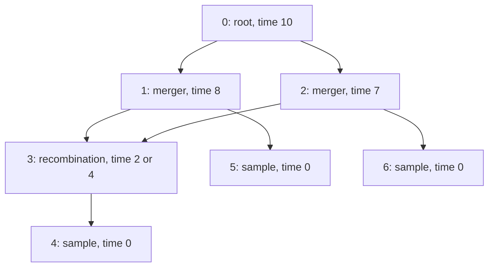

# A timed event-history collision after omitting the recombination node

**Status: locally Lean-checked, attributed formalization of a known information-loss argument.** This is a concrete instance of Wong et al. (2024), Appendix B (printed p. 13, discussion of Fig. 3c), with the precision issues discussed in Appendix H. It is not a new identifiability result or a full stochastic ARG model.

[Published article](https://pmc.ncbi.nlm.nih.gov/articles/PMC11373519/); [primary PDF](https://www.pure.ed.ac.uk/ws/portalfiles/portal/458588307/iyae100.pdf); [DOI](https://doi.org/10.1093/genetics/iyae100).

## What the witness shows

Two valid timed event histories have a recombination at different times. They give exactly the same observed finite interval graph **and the same dates on all retained nodes** when that event node is omitted by a specified local contraction. Their numbers of extant ancestral lineages at an intermediate time differ.

The hidden time is attached to an actual recombination node. The lineage count is calculated from actual graph edges crossing a time slice. Neither target is introduced as a freely changeable numeric annotation.

## Concrete raw histories

Times are exact nonnegative integers measured backwards from sampling, so larger values mean older events. This is a deliberately small discrete-time witness; it does not construct a continuous-time probability law. Integer-valued dates provide enough distinct admissible histories for the information-loss conclusion.

| Raw node ID | Interpretation | Backward time | Parents | Children |
|---|---|---:|---|---|
| 0 | Final common ancestor / root | 10 | None | 1, 2 |
| 1 | Common-ancestor event | 8 | 0 | 3, 5 |
| 2 | Common-ancestor event | 7 | 0 | 3, 6 |
| 3 | Recombination event | $`\tau`$ | 1, 2 | 4 |
| 4 | Recombinant sample | 0 | 3 | None |
| 5 | Other sample | 0 | 1 | None |
| 6 | Other sample | 0 | 2 | None |

The admissible parameter type `EventTime` contains a natural number with proofs $`0<\tau<7`$. The two selected histories use $`\tau=2`$ and $`\tau=4`$.



Arrows point from ancestor to descendant. The checked degree pairs are $`(0,2)`$ at the root, $`(1,2)`$ at each internal merger, $`(2,1)`$ at the recombination, and $`(1,0)`$ at every sample. Thus the raw histories have the strict binary event shapes; no unary placeholder is being relabeled as a merger.

The genome is the half-open span $`[0,2)`$ on natural-number coordinates, with the interior cutoff at 1. Every single-parent edge carries the entire span. Edge $`1\to3`$ carries $`[0,1)`$ and edge $`2\to3`$ carries $`[1,2)`$. This gives two genuine inheritance positions and a nonempty interval on each branch.

`rawEventGraph` is an actual acyclic `EventGraph`; `rawGARG` is the existing checked interval-record encoding with samples $`\{4,5,6\}`$. `history τ` additionally stores all node dates and a proof that every parent is strictly older than its child.

## Exact observation operation

The observation retains raw node IDs $`0,1,2,4,5,6`$ and omits raw node 3. The implementation uses a six-element observed catalogue and the explicit embedding

```math
0\mapsto0,\quad1\mapsto1,\quad2\mapsto2,\quad
3\mapsto4,\quad4\mapsto5,\quad5\mapsto6.
```

The hidden node is absent from the observed catalogue; its date is not left attached to an isolated visible node.

At each genomic position, the observation contracts paths whose only possible internal node is raw node 3. In particular, the two-step paths into sample 4 become direct interval edges. The actual observed gARG has these records:

| Observed parent | Observed child | Inheritance span |
|---:|---:|---|
| 0 | 1 | $`[0,2)`$ |
| 0 | 2 | $`[0,2)`$ |
| 1 | 3 | $`[0,1)`$ |
| 2 | 3 | $`[1,2)`$ |
| 1 | 4 | $`[0,2)`$ |
| 2 | 5 | $`[0,2)`$ |

Its samples are observed IDs $`3,4,5`$. Observed ages are $`10,8,7,0,0,0`$.

`observed_represents_contraction` proves, for every coordinate and pair of observed nodes, that this concrete gARG's local relation equals the existing `AncestryContraction.Contract` relation on their embedded raw nodes. Consequently this is a validated graph observation map, rather than a function that simply discards an arbitrary numeric field without checking the graph operation.

This is a mathematical local contraction, not a correctness theorem about the tskit simplification implementation. It retains the recombinant sample even though the omitted event had a distinct, later backward date. It also retains the designated merger/root nodes; no claim is made that this output is the unique fully simplified graph.

## The different lineage counts are actual crossing-edge counts

For times before the final root, the code counts raw edges $`(p,c)`$ satisfying

```math
\operatorname{age}(c)\leq t<\operatorname{age}(p).
```

This includes a lineage at its younger endpoint and excludes it at its older endpoint, so at an event it counts the lineages immediately after that event in backward time. The witness uses $`t=3`$, which is not any event time in either history.

| History | Active raw edges at $`t=3`$ | Count |
|---|---|---:|
| $`\tau=2`$ | $`(1,3),(2,3),(1,5),(2,6)`$ | 4 |
| $`\tau=4`$ | $`(3,4),(1,5),(2,6)`$ | 3 |

The other two sampled lineages are present in both histories. The difference comes from whether the recombinant sample's lineage has already split. `counted_edge_iff` connects the count predicate to the actual `TimedHistory.graph.Topology` and its actual age function.

The edge-crossing definition is used before root time 10. At or beyond a terminal root, a continuing stochastic-process convention would need an explicit absorbing lineage; no post-root count interpretation is claimed here.

## Checked results

| Selected endpoint | Conclusion |
|---|---|
| `raw_chronology` | Every actual raw parent-child edge obeys strict backward-time chronology. |
| `raw_event_arities` | All seven raw node degree pairs match the stated strict binary event interpretation. |
| `observed_represents_contraction` | The concrete observed interval gARG exactly represents omission of raw node 3 at each locus. |
| `observed_dates_independent` | All retained node dates are independent of $`\tau`$. |
| `observed_chronology` | Every actual observed edge has an older parent. |
| `observation_independent` | Both the observed gARG and its complete retained date function are identical for every admissible $`\tau`$. |
| `counted_edge_iff` | The lineage-count predicate is exactly the actual raw timed-history edge-crossing predicate. |
| `hidden_times_differ` | The omitted recombination occurs at 2 in the first history and 4 in the second. |
| `lineage_counts_differ` | At time 3 the histories have 4 and 3 active lineages, respectively. |
| `sample_date_is_not_event_date` | The recombinant sample remains dated 0, while the omitted event has its separately recorded positive time $`\tau`$. |
| `no_exact_time_decoder` | No function of this observation recovers the recombination time for every admissible history in this family. |
| `no_exact_lineage_decoder` | No function of this observation recovers the time-3 lineage count for every admissible history in this family. |

The no-decoder proofs use the explicit observation collision together with the unequal targets. They rule out a uniformly exact deterministic decoder on this family; they do not assert that every history, every observation or every target is ambiguous.

## Source interpretation and boundaries

Wong's Appendix B explains that omitting explicit recombination events leaves the timing of lineage splitting unresolved without an additional convention. This witness formalizes that limitation with its own small graph, rather than claiming to reproduce every node of Fig. 3c. Appendix H discusses related losses of recombination information under coarser representations.

The following claims are **not** established:

- Equal DNA likelihoods, observational distributions or mutation data under the two histories.
- A probability or prior over the hidden time.
- Statistical impossibility under additional evidence or model constraints.
- Absorption, event-count expectations or rates of a stochastic ARG process.
- A genome-to-organism owner map, a biological species result or an Alexander species classification.
- Recovery of an arbitrary event history from a generic gARG.

The theorem is about exact information in a particular dated graph representation and explicitly named omission. It does not identify a sampled genome node's date with the hidden recombination event date.

## Integrated verification

This module is registered in the real-number project and RealAudit.lean.
The fresh aggregate passed 209 selected endpoints on 25 September 2026,
including the six new Wong modules (58 endpoints). Exact source hashes and
standard-axiom reports are in [the receipt](../verification/real-audit.json).
Reproduce with `python checks/audit_lean.py --real` after pinned dependency setup.
The [PR checks](https://github.com/Sodelin/Work-on-Samuel-Alexander-Research-/pull/6/checks)
record the separate hosted result for each commit.
