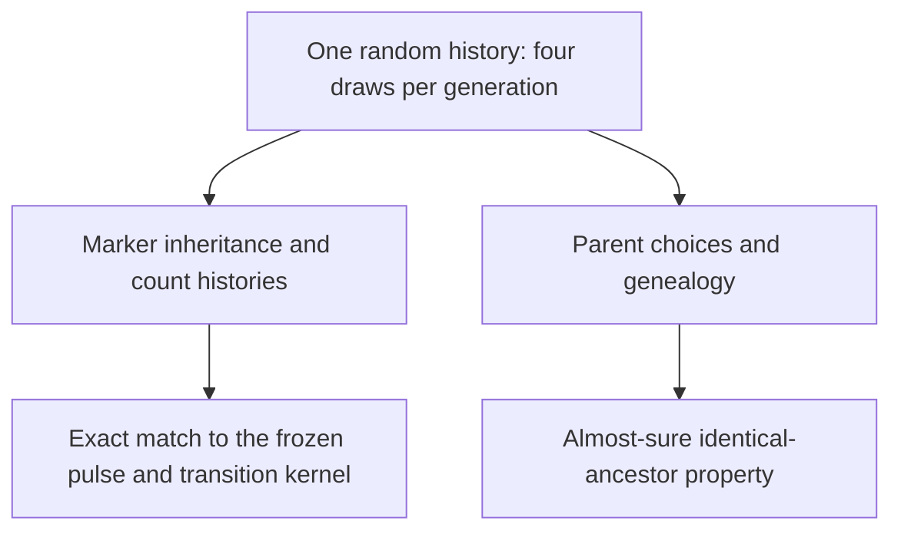

# A shared model for marker inheritance and ancestry

**Checkpoint:** local verification and independent internal review passed for the bounded R1–R6 result. Hosted admission of this packet is pending. [Precise result and scope](pure-induction-ancestry-v2/RESULT-AND-SCOPE.md) · [Local compiler receipts](pure-induction-ancestry-v2/COMBINED-RECEIPT.json) · [Independent review](pure-induction-ancestry-v2/INDEPENDENT-REVIEW.json).

## What connects the two descriptions

Each generation uses four independent uniform draws from fourteen possibilities. Those same draws determine which parents and homologues transmit the marker, and which edges appear in the pedigree. The construction therefore gives the allele counts and the parent graph a common probabilistic model.



The finite kernel has reproductive-isolation statistic $`3/7`$. Its finite count histories are realized by this construction. The pedigree has the whole-history identical-ancestor property with probability one: each organism is eventually an ancestor of all or none of sufficiently late organisms.

These statements answer distinct questions about marker transmission and genealogy. They do not identify a species from DNA.

## The quantitative result

A particular common-parent table has probability $`36/2401`$ in each generation. Thus the probability that it does not occur in a window of $`k`$ generations is

```math
\left(\frac{2365}{2401}\right)^k.
```

Once this table occurs after the organism's birth, its ancestry status resolves for the later population. Non-resolution is therefore bounded by the displayed probability. The same bound holds after conditioning on any positive-probability event in the complete earlier raw history. The proof does not assume that successive marker counts are independent.

The avoidance probability is an equality. The non-resolution statement is an inequality: other parent patterns can also resolve ancestry.

## What was checked

- Raw-draw fibre counts and the actual probabilities of weighted parent/homologue records.
- Every ordinary transition and initialization-pulse entry, including zero mass outside the embedded state space.
- Measurable count paths and parent histories generated from the same random input.
- Finite-path probabilities matching the frozen kernel.
- Unconditional and earlier-history conditional resolution bounds, with measurable events.
- Almost-sure ancestry mixing and the precisely stated conjunction with the marker statistic.

The new connection has **36 selected endpoint reports in four modules**. Hosted integration also registers **31 prerequisite reports in four additional modules**. Together these would increase the standalone audit from 167 to 234 selected declarations; this is an expected audit total until the candidate's hosted run succeeds. The strict axiom checks are preserved.

## A remaining distinction

The packet does not separately define the eventual-fixation event on raw infinite streams and prove that its probability equals the frozen `fixationValue`. Its R6 theorem conjoins the kernel statistic, finite-path realization and ancestry property. That additional infinite-event transfer remains a possible next theorem.

The model is a specified two-deme, two-adult construction. Its assumptions and initialization are part of the result. It supplies no empirical species classification, universal finite-size comparison or worldwide priority claim. [Related prior-art correction](PRIOR-ART-UPDATE-2026-09-25.md).

## Reproduce and inspect

[Reproduction instructions](pure-induction-ancestry-v2/REPRODUCTION.md) describe the portable source packet and exact pins. The original packet is preserved byte-for-byte, including its manifest and historical logs; publication notes sit outside its directory so its integrity verifier continues to work.

The four new modules passed local Lean 4.33.1 checks against previously checked dependency objects. The fresh hosted integration is a separate gate. [Publication integration record](pure-induction-ancestry-v2-publication.json).
