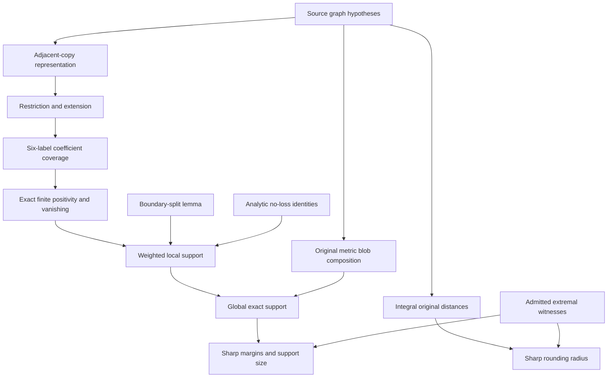

# NANUQ theorem: extremality, generalization, and formalization register

Date: 2026-09-29. Version: 1.

## Purpose and limits

This document systematically asks which assumptions can be weakened, which conclusions can be strengthened, which bounds are sharp, and which proof or computational resources can be reduced. It is a research and formalization specification, not a claim to enumerate every conceivable mathematical extension. It contains **96 individually identified audit items**, each with a current result, extremality status, next obligation, and acceptance criterion.

The user requested an expansive list of every identified point analogous to “level 2 versus all levels” or “six taxa versus five.” An unproved possibility is deliberately retained as OPEN instead of quietly becoming a theorem. A finite equality of coefficient-row catalogues is not automatically a graph-level reduction.

The companion [machine-readable register](extremality-register.json) uses the same stable IDs. The executable [verifier](verify_nanuq.js), its [receipt](verification-results.json), and [proof refinements](PROOF-REFINEMENTS.md) provide concrete evidence. Proposed Lean module paths below are a plan; they are not existing compiled files.

## Current theorem

For every **finite binary semidirected LSA, outer-labeled planar, galled network** on n>=4 taxa, at every finite reticulation level and with any finite number of blobs, the **original unnormalized NANUQ** distance is circular decomposable and has positive split support exactly equal to the union of the splits of its displayed trees.

The metric averages DISTINCT displayed quartet topologies. Its proof may use switching averages as an intermediate step only if their difference from the original average is corrected exactly. The source class, the multiplicity convention, and the distance normalization are part of the theorem.

The main chat reports accepted independent checks of the all-level structural and composition arguments and exact support. This package contributes another executable finite support verification and written refinements. It is **not an end-to-end Lean proof**.

## Most consequential resolved extrema

- Level and blob count: no finite upper bound is needed within the source class.
- Structural coefficient witness: at most six labels is established; a five-label structural reduction remains OPEN.
- Normalized symbolic row catalogue: five labels are exactly sufficient and necessary for the complete catalogue covered by the six-label theorem; four yield 10 rows and five/six yield 16.
- Universal positive split weight: at least 1 in original raw units, with equality in a four-cycle.
- Singleton split weight: at least n-2, attained by a cherry taxon in a tree.
- Universal pendant baseline: n-2 is the maximum amount removable from every singleton weight while retaining nonnegativity for all source networks on n taxa.
- Raw entrywise recovery noise: strictly less than 1/2 permits exact integer rounding; a tree/cycle midpoint proves universal failure at the endpoint.
- Minimum total positive support: exactly 2n-3, or n-3 nontrivial splits.
- Outer-labeled hypothesis: cannot simply be dropped from exact support; an explicit binary galled LSA level-2 counterexample is included.

## Status semantics

| Status | Meaning |
|---|---|
| ESTABLISHED_UPSTREAM | Accepted in the main thread; not rebuilt end-to-end here. |
| PROVED_MATH | Written mathematical proof supplied or explicit consequence; not Lean-verified here. |
| COMPUTER_CHECKED | Exact finite computation passed. |
| COMPUTER_ASSISTED | Unbounded transfer argument plus finite computation. |
| OPEN | An unresolved target, not a proved claim. |
| SPECIFICATION | Required distinction or workflow contract; not a new theorem. |

A checked **claim** is not necessarily an extremal theorem. A SUFFICIENT bound remains open to improvement. SHARP means both a universal bound and a matching admitted witness are supplied. COUNTEREXAMPLE closes the named universal relaxation, not every possible weaker hypothesis. UNBOUNDED_WITHIN_SCOPE removes a finite ceiling; it does not include infinite networks. Every item in this package has a separate Lean status, currently NOT_LEAN_VERIFIED_IN_THIS_PACKAGE.

Priority P0 means source-claim integrity or final formalization. P1 means a bounded high-value refinement or transfer. P2 means a deferred research direction requiring selection and justification. Listing a P2 item does not authorize a new investigation or imply an externally stated open problem.

## Proof architecture and trust boundaries

The JavaScript program verifies the finite node and exact endpoint calculations. Source graph coverage, composition, and the symbolic unbounded arguments are written proofs. A Lean development must close both layers instead of treating the graph identities or source-to-certificate bridge as assumptions.

## Typed formalization contracts

The following contracts are intended to become Lean definitions and theorems. Their names are design identifiers, not claims that code already exists. Each must state exact quantifiers, source domain, and equality conventions. Finite multigraph incidences, unordered splits, and tree isomorphism need explicit representations.

| ID | Contract | Required quantified content | Planned module |
|---|---|---|---|
| L01 | Source network predicates | Finite binary multigraph with taxon labels, hybrid directions, rooted LSA partner, galledness, and outer-labeled embedding. | `Network/Definitions.lean` |
| L02 | Displayed switchings | Independent incoming-edge choices, recursive pruning, degree-two suppression, and displayed-tree support. | `Network/Switchings.lean` |
| L03 | Circular split basis | Correct coefficient formula, inversion factor 1/2, uniqueness in a fixed circular order, and support. | `Metrics/CircularSplits.lean` |
| L04 | Quartet restrictions | Restriction commutes with displayed-tree selection and matches source induced-quarnet support. | `Quartets/Restrictions.lean` |
| L05 | Occurrence representation | Every admitted bloblet opens to an adjacent-copy plane binary tree, preserving original taxon order. | `Representation/PairedTips.lean` |
| L06 | Restriction functoriality | Minimal subtree construction, suppression invariance, and extension of partial occurrence selections. | `Representation/Restriction.lean` |
| L07 | Six-role locality | Each anchor coefficient depends on at most six retained labels and the same two boundary gaps. | `Metrics/CoefficientLocality.lean` |
| L08 | Enumeration coverage | Every reduced occurrence tree appears in the finite ordered-tree enumerator; state quotient preserves evaluation. | `Certificates/Coverage.lean` |
| L09 | Finite positivity and vanishing | Kernel-check nonnegativity and absence-boundary-topology implies zero for every finite anchor coefficient. | `Certificates/AnchorFacts.lean` |
| L10 | Weighted anchor identity | W(m)=sum m_p*m_q*M_pq including diagonal, overlapping anchors, and small-port conventions. | `Metrics/WeightedAnchors.lean` |
| L11 | Boundary-split lemma | For nontrivial circular S, displayed S iff its four adjacent boundary taxa display bc|ad. | `Support/Boundary.lean` |
| L12 | Analytic no-loss | Two explicit positive anchors for internal splits and one for singleton splits. | `Support/NoLoss.lean` |
| L13 | No-false transfer | Positive coefficient restricts to <=6 labels, finite vanishing excludes absent boundary quartet, and selection extends. | `Support/NoFalseSplits.lean` |
| L14 | Local source admission | Capping blobs preserves rooted LSA partner, galledness, binary degree, and outer-face ports. | `Network/Capping.lean` |
| L15 | Blob tree and masses | Port blocks partition all taxa, are nonempty, and occur consecutively in one global order. | `Network/BlobTree.lean` |
| L16 | Switching product and path identity | Choices factor by blob; every selected-tree branching contribution has unique local ownership. | `Composition/SwitchingIdentity.lean` |
| L17 | Uniform-distinct correction | A quartet is bridge-resolved or has a unique four-port central blob; compare both supports and marginals. | `Composition/DistinctCorrection.lean` |
| L18 | Exact original composition | Derive, rather than assume, the sum of local W pullbacks for the source d_N. | `Composition/OriginalNANUQ.lean` |
| L19 | Global support lift | Both inclusions, especially branching endpoints bypassing zero two-port matrices. | `Support/Global.lean` |
| L20 | Margins and optimal baseline | Positive weight>=1, singleton>=n-2, mass-sensitive bounds, and equality witnesses. | `Extrema/Margins.lean` |
| L21 | Integral source matrix | At most two displayed planar quartet topologies; 2rho integral; sum gives integral d_N. | `Robustness/Integrality.lean` |
| L22 | Sharp rounding recovery | Entrywise error<1/2 recovers integer d; tree/cycle midpoint proves endpoint impossibility. | `Robustness/SharpRadius.lean` |
| L23 | Explicit graph witnesses | Check cycle/tree and non-outer theta objects, source predicates, switchings, matrices, and support. | `Witnesses/ExtremalNetworks.lean` |
| L24 | Row-catalogue minimum | Check normalization by positive gcd, five/six equality, and a row first occurring at five. | `Certificates/CatalogueMinimum.lean` |
| L25 | Final theorem assembly | All dependencies discharged from source predicates; inspect axioms and theorem signatures. | `Main.lean` |

### Required theorem shapes

1. **Coverage:** for every admitted network, every distinct anchor pair, and every pair of distinct circular gaps, there exists a reduced paired-tip representation on at most six labels with exactly the same anchor coefficient.
2. **Finite certificate:** for every generated representation and every queried anchor/gap pair, the exact coefficient is nonnegative; if the boundary quartet is absent it is zero.
3. **Weighted support:** for every admitted capped bloblet with at least three ports and every strictly positive real mass assignment, alpha>0 if and only if the split is displayed.
4. **Composition:** for every admitted source network and every taxon pair, the original distance is the sum of local weighted pullbacks, including the precise two/three-port conventions.
5. **Global support:** for every circular split, its canonical coefficient is positive exactly when some displayed global tree contains it.
6. **Extremum:** a bound must be paired with an admitted witness attaining it, or a sequence proving an unattained infimum/supremum.
7. **Noise:** for every promised integer-valued source distance and every observed matrix within the strict radius, recovery succeeds; a concrete pair at the endpoint defeats every universally correct estimator.
8. **Minimum certificate size:** define whether size means taxa in a graph restriction, distinct symbolic rows, occurrence count, state count, or number of arithmetic checks. These are different minimization problems.

## Full item register

## S. Source class and scope

### S-01 — Reticulation level

- [x] Current claim established at the stated evidence level.
- [x] Named extremum or universal-relaxation question closed.
- [ ] Lean kernel verification completed in this package.

**Current result:** Every finite level is covered in the stated class.

**Machine status:** `ESTABLISHED_UPSTREAM`. **Bound status:** `UNBOUNDED_WITHIN_SCOPE`. **Priority:** `P0`.

**Next proof or experiment:** Port accepted structural and finite certificates into a source-level formal theorem.

**Acceptance criterion:** No upper bound on level appears in the theorem hypotheses.

### S-02 — Number of blobs

- [x] Current claim established at the stated evidence level.
- [x] Named extremum or universal-relaxation question closed.
- [ ] Lean kernel verification completed in this package.

**Current result:** Arbitrarily many finite blobs are covered by original-NANUQ composition.

**Machine status:** `ESTABLISHED_UPSTREAM`. **Bound status:** `UNBOUNDED_WITHIN_SCOPE`. **Priority:** `P0`.

**Next proof or experiment:** Preserve the complete graph-to-composition proof, including small blobs.

**Acceptance criterion:** Source theorem quantifies over every finite admitted network.

### S-03 — Number of taxa

- [x] Current claim established at the stated evidence level.
- [x] Named extremum or universal-relaxation question closed.
- [ ] Lean kernel verification completed in this package.

**Current result:** The source theorem covers every finite n>=4; auxiliary local cases use 2 and 3 ports.

**Machine status:** `ESTABLISHED_UPSTREAM`. **Bound status:** `UNBOUNDED_WITHIN_SCOPE`. **Priority:** `P0`.

**Next proof or experiment:** Separate source definition from auxiliary small-port conventions.

**Acceptance criterion:** No finite-taxon ceiling or silent use of a four-taxon definition at n=3.

### S-04 — Outer-labeled planarity

- [x] Current claim established at the stated evidence level.
- [x] Named extremum or universal-relaxation question closed.
- [ ] Lean kernel verification completed in this package.

**Current result:** Dropping it universally breaks exact support, already at level 2.

**Machine status:** `PROVED_MATH`. **Bound status:** `COUNTEREXAMPLE`. **Priority:** `P1`.

**Next proof or experiment:** Kernel-check the explicit six-internal-vertex counterexample and its admission.

**Acceptance criterion:** Binary, galled, LSA, level-2 witness displays all three quartets but its distance is a star.

### S-05 — Galledness

- [ ] Current claim established at the stated evidence level.
- [ ] Named extremum or universal-relaxation question closed.
- [ ] Lean kernel verification completed in this package.

**Current result:** Used for leaf-hybrid occurrence representation and local capping.

**Machine status:** `OPEN`. **Bound status:** `UNKNOWN`. **Priority:** `P1`.

**Next proof or experiment:** Search a precisely defined nongalled outer-labeled subclass; prove coverage or find a counterexample.

**Acceptance criterion:** A weaker explicit graph condition with proof, or an admitted failure witness.

### S-06 — Binarity

- [ ] Current claim established at the stated evidence level.
- [ ] Named extremum or universal-relaxation question closed.
- [ ] Lean kernel verification completed in this package.

**Current result:** Assumed for quartet resolutions, degree-three endpoint contributions, and occurrence trees.

**Machine status:** `OPEN`. **Bound status:** `UNKNOWN`. **Priority:** `P2`.

**Next proof or experiment:** Specify soft versus hard polytomies before testing nonbinary extensions.

**Acceptance criterion:** One unambiguous nonbinary metric and a source-level theorem or obstruction.

### S-07 — Root-LSA condition

- [ ] Current claim established at the stated evidence level.
- [ ] Named extremum or universal-relaxation question closed.
- [ ] Lean kernel verification completed in this package.

**Current result:** Used to ensure both sides of every bridge contain taxa and to admit capped bloblets.

**Machine status:** `OPEN`. **Bound status:** `UNKNOWN`. **Priority:** `P2`.

**Next proof or experiment:** Prove LSA trimming preserves the metric and target split system under exact conventions.

**Acceptance criterion:** A normalization theorem or a counterexample to removing the hypothesis.

### S-08 — Semidirected versus rooted input

- [ ] Current claim established at the stated evidence level.
- [ ] Named extremum or universal-relaxation question closed.
- [ ] Lean kernel verification completed in this package.

**Current result:** The theorem is stated for semidirected LSA networks admitting rooted partners.

**Machine status:** `OPEN`. **Bound status:** `UNKNOWN`. **Priority:** `P2`.

**Next proof or experiment:** Prove invariance across rooted partners and characterize needed orientations.

**Acceptance criterion:** Root-choice independence and exact transfer maps.

### S-09 — Parallel edges and two-cycles

- [x] Current claim established at the stated evidence level.
- [ ] Named extremum or universal-relaxation question closed.
- [ ] Lean kernel verification completed in this package.

**Current result:** Allowed source incidences need careful small-blob handling.

**Machine status:** `ESTABLISHED_UPSTREAM`. **Bound status:** `SUFFICIENT`. **Priority:** `P1`.

**Next proof or experiment:** Formalize parallel incidences instead of assuming a simple graph.

**Acceptance criterion:** No unproved exclusion of admitted bigons.

### S-10 — Zero or one ordinary taxon

- [x] Current claim established at the stated evidence level.
- [ ] Named extremum or universal-relaxation question closed.
- [ ] Lean kernel verification completed in this package.

**Current result:** The occurrence-tree proof need not assume tree-child or ordinary leaves exist.

**Machine status:** `ESTABLISHED_UPSTREAM`. **Bound status:** `SUFFICIENT`. **Priority:** `P2`.

**Next proof or experiment:** Retain unlabeled skeleton leaves until occurrence stubs restore degree three.

**Acceptance criterion:** Representation proof covers all-hybrid leaf configurations.

### S-11 — Tree-child condition

- [x] Current claim established at the stated evidence level.
- [ ] Named extremum or universal-relaxation question closed (not a numeric extremum; see the stated contract).
- [ ] Lean kernel verification completed in this package.

**Current result:** Not required by the current representation argument.

**Machine status:** `ESTABLISHED_UPSTREAM`. **Bound status:** `NOT_A_BOUND`. **Priority:** `P1`.

**Next proof or experiment:** Audit that no imported lemma silently adds tree-child.

**Acceptance criterion:** Final theorem has no tree-child assumption.

### S-12 — Infinite networks

- [ ] Current claim established at the stated evidence level.
- [ ] Named extremum or universal-relaxation question closed.
- [ ] Lean kernel verification completed in this package.

**Current result:** Only finite networks and finite sums are covered.

**Machine status:** `OPEN`. **Bound status:** `UNKNOWN`. **Priority:** `P2`.

**Next proof or experiment:** Define an infinite object, topology, quartet measure, and convergent metric before extension.

**Acceptance criterion:** A well-posed statement; no extrapolation from arbitrary finite level.

## R. Representation and witness-size minima

### R-01 — Six-label coefficient bound

- [x] Current claim established at the stated evidence level.
- [ ] Named extremum or universal-relaxation question closed.
- [ ] Lean kernel verification completed in this package.

**Current result:** Two anchors and four boundary labels give a proved bound of at most six.

**Machine status:** `ESTABLISHED_UPSTREAM`. **Bound status:** `SUFFICIENT`. **Priority:** `P0`.

**Next proof or experiment:** Formalize restriction and equality of each queried coefficient.

**Acceptance criterion:** A source-to-finite certificate theorem with no hidden coverage assumption.

### R-02 — Five-label structural reduction

- [ ] Current claim established at the stated evidence level.
- [ ] Named extremum or universal-relaxation question closed.
- [ ] Lean kernel verification completed in this package.

**Current result:** No proof that every six-label coefficient query reduces structurally to five is supplied.

**Machine status:** `OPEN`. **Bound status:** `UNKNOWN`. **Priority:** `P1`.

**Next proof or experiment:** Find a deletion, relabeling, or convex-combination reduction preserving the relevant sign/zero assertion.

**Acceptance criterion:** Uniform constructive transfer, not merely equality of finite row lists.

### R-03 — Minimum symbolic row-catalogue size

- [x] Current claim established at the stated evidence level.
- [x] Named extremum or universal-relaxation question closed.
- [ ] Lean kernel verification completed in this package.

**Current result:** Four labels yield 10 rows; five and six yield the same 16 normalized rows.

**Machine status:** `COMPUTER_CHECKED`. **Bound status:** `SHARP`. **Priority:** `P1`.

**Next proof or experiment:** Port exact row-set equality and a row absent at four into a finite formal certificate.

**Acceptance criterion:** Minimum is five for this precisely defined catalogue, conditional on the six-label coverage theorem.

### R-04 — Four-label positivity tests

- [x] Current claim established at the stated evidence level.
- [x] Named extremum or universal-relaxation question closed.
- [ ] Lean kernel verification completed in this package.

**Current result:** They do not certify the full symbolic anchor-positivity domain.

**Machine status:** `COMPUTER_CHECKED`. **Bound status:** `COUNTEREXAMPLE`. **Priority:** `P1`.

**Next proof or experiment:** Use (c,s,a,o)=(0,1,1/4,1) and saved five-label negative-row witness.

**Acceptance criterion:** All four-label inequalities pass while a five-label coefficient is negative.

### R-05 — Minimum support-witness size

- [x] Current claim established at the stated evidence level.
- [ ] Named extremum or universal-relaxation question closed.
- [ ] Lean kernel verification completed in this package.

**Current result:** Four boundary labels witness a displayed nontrivial circular split; three suffice for singleton positivity.

**Machine status:** `PROVED_MATH`. **Bound status:** `SUFFICIENT`. **Priority:** `P1`.

**Next proof or experiment:** Distinguish support witnesses from complete coefficient queries.

**Acceptance criterion:** Separate statements with their exact quantified roles.

### R-06 — Minimum doubled-tip count

- [ ] Current claim established at the stated evidence level.
- [ ] Named extremum or universal-relaxation question closed.
- [ ] Lean kernel verification completed in this package.

**Current result:** The general witness uses at most twelve occurrences for six labels.

**Machine status:** `OPEN`. **Bound status:** `UNKNOWN`. **Priority:** `P2`.

**Next proof or experiment:** Classify whether some repeated occurrences can be removed without changing the needed coefficient.

**Acceptance criterion:** A smaller universal occurrence bound or minimal obstruction.

### R-07 — Adjacent-pair representation

- [x] Current claim established at the stated evidence level.
- [ ] Named extremum or universal-relaxation question closed.
- [ ] Lean kernel verification completed in this package.

**Current result:** Every admitted bloblet has a paired-tip plane-tree representation.

**Machine status:** `ESTABLISHED_UPSTREAM`. **Bound status:** `SUFFICIENT`. **Priority:** `P0`.

**Next proof or experiment:** Kernel-check tree skeleton, face count, contour order, and switching correspondence.

**Acceptance criterion:** No drawing-based or level-bounded coverage argument.

### R-08 — More than two occurrences per label

- [ ] Current claim established at the stated evidence level.
- [ ] Named extremum or universal-relaxation question closed.
- [ ] Lean kernel verification completed in this package.

**Current result:** Current representation has one or two occurrences only.

**Machine status:** `OPEN`. **Bound status:** `UNKNOWN`. **Priority:** `P2`.

**Next proof or experiment:** Define independent occurrence selection for higher multiplicity and test support/positivity.

**Acceptance criterion:** A theorem for a stated multiplicity class or a smallest counterexample.

### R-09 — Adjacency of repeated occurrences

- [x] Current claim established at the stated evidence level.
- [x] Named extremum or universal-relaxation question closed.
- [ ] Lean kernel verification completed in this package.

**Current result:** Required for common taxon order; nonadjacent pairs admit the support counterexample.

**Machine status:** `PROVED_MATH`. **Bound status:** `COUNTEREXAMPLE`. **Priority:** `P2`.

**Next proof or experiment:** Determine the weakest noncrossing occurrence condition sufficient for the proof.

**Acceptance criterion:** Precisely characterize any relaxation rather than dropping adjacency wholesale.

### R-10 — Pruning convention

- [x] Current claim established at the stated evidence level.
- [ ] Named extremum or universal-relaxation question closed (not a numeric extremum; see the stated contract).
- [ ] Lean kernel verification completed in this package.

**Current result:** Restriction requires a minimal connecting subtree or recursive pruning before suppression.

**Machine status:** `PROVED_MATH`. **Bound status:** `NOT_A_BOUND`. **Priority:** `P0`.

**Next proof or experiment:** Formalize the operation and prove its idempotence and functoriality.

**Acceptance criterion:** No dangling unlabeled tips survive restriction.

### R-11 — Smallest certificate state space

- [x] Current claim established at the stated evidence level.
- [ ] Named extremum or universal-relaxation question closed.
- [ ] Lean kernel verification completed in this package.

**Current result:** 122 quartet systems occur across sizes three through six in the larger representation class.

**Machine status:** `COMPUTER_CHECKED`. **Bound status:** `SUFFICIENT`. **Priority:** `P2`.

**Next proof or experiment:** Prove soundness of any further state quotient, including support information.

**Acceptance criterion:** A reduced certificate with a coverage-preserving quotient map.

### R-12 — Source realizability of screened trees

- [x] Current claim established at the stated evidence level.
- [ ] Named extremum or universal-relaxation question closed.
- [ ] Lean kernel verification completed in this package.

**Current result:** The finite screen intentionally covers a superset of source bloblets.

**Machine status:** `ESTABLISHED_UPSTREAM`. **Bound status:** `SUFFICIENT`. **Priority:** `P2`.

**Next proof or experiment:** Classify realizability only if it reduces work or strengthens necessity claims.

**Acceptance criterion:** Never infer a source counterexample solely from a nonrealizable representation.

## C. Coefficients, weights, and exact extrema

### C-01 — No lost nontrivial splits

- [x] Current claim established at the stated evidence level.
- [ ] Named extremum or universal-relaxation question closed.
- [ ] Lean kernel verification completed in this package.

**Current result:** Two explicit boundary anchor pairs prove positivity analytically.

**Machine status:** `PROVED_MATH`. **Bound status:** `SUFFICIENT`. **Priority:** `P0`.

**Next proof or experiment:** Formalize alpha(M_ad)=alpha(M_bc)=tau in {0,1,2}.

**Acceptance criterion:** Displayed boundary quartet implies a positive original coefficient.

### C-02 — No spurious splits

- [x] Current claim established at the stated evidence level.
- [ ] Named extremum or universal-relaxation question closed.
- [ ] Lean kernel verification completed in this package.

**Current result:** At most six labels suffice for the finite vanishing test plus boundary lifting.

**Machine status:** `COMPUTER_ASSISTED`. **Bound status:** `SUFFICIENT`. **Priority:** `P0`.

**Next proof or experiment:** Kernel-check finite vanishing and its source transfer.

**Acceptance criterion:** Absent boundary quartet forces every anchor coefficient to vanish.

### C-03 — Smallest positive global split weight

- [x] Current claim established at the stated evidence level.
- [x] Named extremum or universal-relaxation question closed.
- [ ] Lean kernel verification completed in this package.

**Current result:** For original raw NANUQ and integer port masses every positive weight is at least 1.

**Machine status:** `PROVED_MATH`. **Bound status:** `SHARP`. **Priority:** `P1`.

**Next proof or experiment:** Formalize lower bound and four-cycle equality witness.

**Acceptance criterion:** Universal lower bound 1 and an admitted example attaining it.

### C-04 — Smallest singleton split weight

- [x] Current claim established at the stated evidence level.
- [x] Named extremum or universal-relaxation question closed.
- [ ] Lean kernel verification completed in this package.

**Current result:** On n source taxa, every singleton weight is at least n-2.

**Machine status:** `PROVED_MATH`. **Bound status:** `SHARP`. **Priority:** `P1`.

**Next proof or experiment:** Use paired neighbor-anchor identities and a tree with the target taxon in a cherry.

**Acceptance criterion:** Universal n-2 bound and source examples for each n>=4.

### C-05 — Weighted nontrivial lower bound

- [x] Current claim established at the stated evidence level.
- [ ] Named extremum or universal-relaxation question closed.
- [ ] Lean kernel verification completed in this package.

**Current result:** alpha_S>=tau*(m_a*m_d+m_b*m_c), where tau is 1 or 2 for a displayed split.

**Machine status:** `PROVED_MATH`. **Bound status:** `SUFFICIENT`. **Priority:** `P2`.

**Next proof or experiment:** Characterize equality and whether other anchors force a stronger bound.

**Acceptance criterion:** An exact minimum with fixed mass vector and specified boundary quartet.

### C-06 — Weighted singleton lower bound

- [x] Current claim established at the stated evidence level.
- [ ] Named extremum or universal-relaxation question closed.
- [ ] Lean kernel verification completed in this package.

**Current result:** alpha_b>=2m_a m_d+2 min(m_a,m_d) sum_other m_t.

**Machine status:** `PROVED_MATH`. **Bound status:** `SUFFICIENT`. **Priority:** `P2`.

**Next proof or experiment:** Optimize over admitted representations for a fixed positive mass vector.

**Acceptance criterion:** A sharp formula or a proved gap to this lower bound.

### C-07 — Strictly positive real masses

- [x] Current claim established at the stated evidence level.
- [ ] Named extremum or universal-relaxation question closed.
- [ ] Lean kernel verification completed in this package.

**Current result:** Local nonnegativity and support transfer hold for all positive real masses.

**Machine status:** `PROVED_MATH`. **Bound status:** `SUFFICIENT`. **Priority:** `P1`.

**Next proof or experiment:** Formalize ordered-semiring needs and positivity of products.

**Acceptance criterion:** No accidental integer assumption in the local support theorem.

### C-08 — Nonnegative masses including zero

- [ ] Current claim established at the stated evidence level.
- [ ] Named extremum or universal-relaxation question closed.
- [ ] Lean kernel verification completed in this package.

**Current result:** Nonnegativity extends by polynomial evaluation; exact support may shrink.

**Machine status:** `OPEN`. **Bound status:** `UNKNOWN`. **Priority:** `P2`.

**Next proof or experiment:** Characterize support by surviving positive anchor products and delete zero-mass ports carefully.

**Acceptance criterion:** Necessary and sufficient support condition, with degenerate-order conventions.

### C-09 — Negative masses

- [ ] Current claim established at the stated evidence level.
- [ ] Named extremum or universal-relaxation question closed.
- [ ] Lean kernel verification completed in this package.

**Current result:** The current positivity proof does not permit them.

**Machine status:** `OPEN`. **Bound status:** `UNKNOWN`. **Priority:** `P2`.

**Next proof or experiment:** Decide whether any scientifically meaningful signed variant is intended.

**Acceptance criterion:** Either an explicit restricted cone or a deliberate scope exclusion.

### C-10 — Uniform positive margin for real masses

- [x] Current claim established at the stated evidence level.
- [x] Named extremum or universal-relaxation question closed.
- [ ] Lean kernel verification completed in this package.

**Current result:** No mass-independent positive margin exists under arbitrary positive scaling.

**Machine status:** `PROVED_MATH`. **Bound status:** `COUNTEREXAMPLE`. **Priority:** `P2`.

**Next proof or experiment:** Record W(lambda m)=lambda^2 W(m).

**Acceptance criterion:** A scaling counterexample; state any margin in terms of a mass lower bound.

### C-11 — Largest individual split weight

- [ ] Current claim established at the stated evidence level.
- [ ] Named extremum or universal-relaxation question closed.
- [ ] Lean kernel verification completed in this package.

**Current result:** No sharp general bound with fixed n is established in this package.

**Machine status:** `OPEN`. **Bound status:** `UNKNOWN`. **Priority:** `P2`.

**Next proof or experiment:** Optimize alpha subject to admitted quartet systems; give attaining networks.

**Acceptance criterion:** Matching upper bound and admitted extremizers.

### C-12 — Largest singleton weight

- [ ] Current claim established at the stated evidence level.
- [ ] Named extremum or universal-relaxation question closed.
- [ ] Lean kernel verification completed in this package.

**Current result:** No sharp maximum with fixed n is proved here.

**Machine status:** `OPEN`. **Bound status:** `UNKNOWN`. **Priority:** `P2`.

**Next proof or experiment:** Compare tree product bounds with network mixtures and uniform-distinct corrections.

**Acceptance criterion:** A complete n-dependent extremal theorem.

### C-13 — Maximum number of positive splits

- [x] Current claim established at the stated evidence level.
- [ ] Named extremum or universal-relaxation question closed.
- [ ] Lean kernel verification completed in this package.

**Current result:** A circular order has at most n(n-1)/2 splits, including n singleton splits.

**Machine status:** `PROVED_MATH`. **Bound status:** `SUFFICIENT`. **Priority:** `P2`.

**Next proof or experiment:** Determine which source networks attain the full circular set and minimum level needed.

**Acceptance criterion:** Construction plus lower bounds on level or number of hybrids.

### C-14 — Minimum support size

- [x] Current claim established at the stated evidence level.
- [x] Named extremum or universal-relaxation question closed.
- [ ] Lean kernel verification completed in this package.

**Current result:** Every displayed binary n-leaf tree contributes 2n-3 distinct splits, so exact support has at least 2n-3; admitted trees attain equality.

**Machine status:** `PROVED_MATH`. **Bound status:** `SHARP`. **Priority:** `P1`.

**Next proof or experiment:** Formalize displayed-tree existence and binary-tree edge count, then specialize exact support.

**Acceptance criterion:** Minimum 2n-3 total splits, equivalently n-3 nontrivial splits, with admitted equality witnesses.

### C-15 — Coefficient lattice

- [x] Current claim established at the stated evidence level.
- [ ] Named extremum or universal-relaxation question closed.
- [ ] Lean kernel verification completed in this package.

**Current result:** Raw distances and alpha are integers; split weights lie in half-integers.

**Machine status:** `PROVED_MATH`. **Bound status:** `SUFFICIENT`. **Priority:** `P1`.

**Next proof or experiment:** Decide whether all positive weights are actually integers in this class.

**Acceptance criterion:** Either an odd-alpha admitted witness or a parity theorem.

### C-16 — Residual quartet matrix

- [x] Current claim established at the stated evidence level.
- [ ] Named extremum or universal-relaxation question closed.
- [ ] Lean kernel verification completed in this package.

**Current result:** Subtracting 2n-4 off diagonal leaves a circular pseudometric.

**Machine status:** `PROVED_MATH`. **Bound status:** `SUFFICIENT`. **Priority:** `P2`.

**Next proof or experiment:** Characterize when the residual separates all taxa.

**Acceptance criterion:** Necessary and sufficient criterion for residual metric versus pseudometric.

### C-17 — Baseline subtraction optimality

- [x] Current claim established at the stated evidence level.
- [x] Named extremum or universal-relaxation question closed.
- [ ] Lean kernel verification completed in this package.

**Current result:** Uniform pendant subtraction n-2 is largest valid for every n-taxon source network.

**Machine status:** `PROVED_MATH`. **Bound status:** `SHARP`. **Priority:** `P2`.

**Next proof or experiment:** Formalize cherry singleton equality as obstruction to a larger universal baseline.

**Acceptance criterion:** A larger subtraction creates a negative pendant coefficient in an admitted tree.

## D. Split support and identifiability

### D-01 — Full support equality

- [x] Current claim established at the stated evidence level.
- [x] Named extremum or universal-relaxation question closed.
- [ ] Lean kernel verification completed in this package.

**Current result:** Positive coefficients equal the union of displayed-tree splits at every finite level.

**Machine status:** `ESTABLISHED_UPSTREAM`. **Bound status:** `UNBOUNDED_WITHIN_SCOPE`. **Priority:** `P0`.

**Next proof or experiment:** Assemble source theorem without unproved graph premises.

**Acceptance criterion:** End-to-end statement with explicit computational dependencies.

### D-02 — Boundary-split equivalence

- [x] Current claim established at the stated evidence level.
- [ ] Named extremum or universal-relaxation question closed.
- [ ] Lean kernel verification completed in this package.

**Current result:** A nontrivial circular split is displayed exactly when its boundary quartet is displayed.

**Machine status:** `PROVED_MATH`. **Bound status:** `SUFFICIENT`. **Priority:** `P0`.

**Next proof or experiment:** Formalize the two-boundary-transition argument on a cyclic order.

**Acceptance criterion:** No assumption that arbitrary restricted splits lift.

### D-03 — Known versus inferred circular order

- [ ] Current claim established at the stated evidence level.
- [ ] Named extremum or universal-relaxation question closed.
- [ ] Lean kernel verification completed in this package.

**Current result:** Current direct coefficient extraction uses a correct outer-face order.

**Machine status:** `OPEN`. **Bound status:** `UNKNOWN`. **Priority:** `P1`.

**Next proof or experiment:** Characterize all compatible orders or give a certified order-finding algorithm.

**Acceptance criterion:** Verified recovery without assuming the answer order.

### D-04 — Uniqueness of circular order

- [ ] Current claim established at the stated evidence level.
- [ ] Named extremum or universal-relaxation question closed.
- [ ] Lean kernel verification completed in this package.

**Current result:** Several orders may represent the same split system, especially for trees.

**Machine status:** `OPEN`. **Bound status:** `UNKNOWN`. **Priority:** `P2`.

**Next proof or experiment:** Describe equivalence classes of valid orders and nonidentifiability.

**Acceptance criterion:** Necessary and sufficient uniqueness conditions.

### D-05 — Network uniqueness from split union

- [ ] Current claim established at the stated evidence level.
- [ ] Named extremum or universal-relaxation question closed.
- [ ] Lean kernel verification completed in this package.

**Current result:** Exact split support alone does not establish unique network reconstruction.

**Machine status:** `OPEN`. **Bound status:** `UNKNOWN`. **Priority:** `P2`.

**Next proof or experiment:** Find same-support nonisomorphic source networks or prove uniqueness in a subclass.

**Acceptance criterion:** An admitted witness or reconstruction theorem with explicit quotient.

### D-06 — Canonical forms at all levels

- [ ] Current claim established at the stated evidence level.
- [ ] Named extremum or universal-relaxation question closed.
- [ ] Lean kernel verification completed in this package.

**Current result:** No all-level canonical-form classification follows automatically.

**Machine status:** `OPEN`. **Bound status:** `UNKNOWN`. **Priority:** `P1`.

**Next proof or experiment:** Specify equivalence by quartet sets, splits, or distances separately.

**Acceptance criterion:** Complete invariant and both directions of equivalence.

### D-07 — Quartet sets from split union

- [x] Current claim established at the stated evidence level.
- [ ] Named extremum or universal-relaxation question closed.
- [ ] Lean kernel verification completed in this package.

**Current result:** Every quartet displayed by a tree has an edge witness, so union-of-tree splits determines quartet support.

**Machine status:** `PROVED_MATH`. **Bound status:** `SUFFICIENT`. **Priority:** `P1`.

**Next proof or experiment:** Formalize restriction of a split and existence of a displayed-tree witness.

**Acceptance criterion:** Exact quartet-support reconstruction from the displayed split union.

### D-08 — Quartet equivalence versus distance equivalence

- [ ] Current claim established at the stated evidence level.
- [ ] Named extremum or universal-relaxation question closed.
- [ ] Lean kernel verification completed in this package.

**Current result:** For a fixed n and class, quartet sets determine d; exact-support recovery may give the converse.

**Machine status:** `OPEN`. **Bound status:** `UNKNOWN`. **Priority:** `P1`.

**Next proof or experiment:** Combine support recovery with the previous edge-witness lemma, handling unknown order.

**Acceptance criterion:** Precise equivalence theorem without smuggling in network uniqueness.

### D-09 — Switching multiplicities

- [ ] Current claim established at the stated evidence level.
- [ ] Named extremum or universal-relaxation question closed.
- [ ] Lean kernel verification completed in this package.

**Current result:** Uniform-distinct d does not directly retain switching frequencies.

**Machine status:** `OPEN`. **Bound status:** `UNKNOWN`. **Priority:** `P2`.

**Next proof or experiment:** Construct networks with equal quartet sets but different switching distributions.

**Acceptance criterion:** A loss-of-information witness or a recoverable subclass.

### D-10 — Hybrid directions

- [ ] Current claim established at the stated evidence level.
- [ ] Named extremum or universal-relaxation question closed.
- [ ] Lean kernel verification completed in this package.

**Current result:** Support theorem does not promise recovery of every hybrid orientation.

**Machine status:** `OPEN`. **Bound status:** `UNKNOWN`. **Priority:** `P2`.

**Next proof or experiment:** Test direction changes preserving displayed splits and quartet sets.

**Acceptance criterion:** Exact orientation-identifiability criterion.

### D-11 — Reticulation count and level

- [ ] Current claim established at the stated evidence level.
- [ ] Named extremum or universal-relaxation question closed.
- [ ] Lean kernel verification completed in this package.

**Current result:** Metric recovery does not automatically identify hybrid count or level.

**Machine status:** `OPEN`. **Bound status:** `UNKNOWN`. **Priority:** `P2`.

**Next proof or experiment:** Seek different-level networks with equal d and distinguish minimal realization.

**Acceptance criterion:** A counterexample or a minimum-level reconstruction theorem.

### D-12 — Tree of blobs recovery

- [ ] Current claim established at the stated evidence level.
- [ ] Named extremum or universal-relaxation question closed.
- [ ] Lean kernel verification completed in this package.

**Current result:** The source paper connects the support conjecture to recovering this structure.

**Machine status:** `OPEN`. **Bound status:** `UNKNOWN`. **Priority:** `P1`.

**Next proof or experiment:** Implement the exact split-to-blob-tree theorem with source hypotheses.

**Acceptance criterion:** Certified structural recovery, not merely a visual split graph.

## B. Composition, ports, and graph degeneracies

### B-01 — Original-NANUQ composition

- [x] Current claim established at the stated evidence level.
- [ ] Named extremum or universal-relaxation question closed.
- [ ] Lean kernel verification completed in this package.

**Current result:** The all-level exact identity has passed the main chat's written audit.

**Machine status:** `ESTABLISHED_UPSTREAM`. **Bound status:** `SUFFICIENT`. **Priority:** `P0`.

**Next proof or experiment:** Derive hswitch and hlocalize from raw graph assumptions in Lean.

**Acceptance criterion:** No unproved composition identities remain as final source hypotheses.

### B-02 — Positive port masses

- [x] Current claim established at the stated evidence level.
- [ ] Named extremum or universal-relaxation question closed.
- [ ] Lean kernel verification completed in this package.

**Current result:** LSA and finiteness ensure taxa on both sides of every bridge.

**Machine status:** `ESTABLISHED_UPSTREAM`. **Bound status:** `SUFFICIENT`. **Priority:** `P0`.

**Next proof or experiment:** Formalize leaf existence and domination contradiction.

**Acceptance criterion:** Every port block is nonempty and blocks partition all taxa.

### B-03 — Two-port blobs

- [x] Current claim established at the stated evidence level.
- [x] Named extremum or universal-relaxation question closed.
- [ ] Lean kernel verification completed in this package.

**Current result:** Their local W is zero, so exact local support must not be claimed for them.

**Machine status:** `PROVED_MATH`. **Bound status:** `COUNTEREXAMPLE`. **Priority:** `P0`.

**Next proof or experiment:** Formalize bypass through a branching endpoint in a >=3-port blob.

**Acceptance criterion:** All global edge splits accounted for despite zero two-port terms.

### B-04 — Three-port blobs

- [x] Current claim established at the stated evidence level.
- [ ] Named extremum or universal-relaxation question closed.
- [ ] Lean kernel verification completed in this package.

**Current result:** Their matrix is a positive weighted star regardless of local reticulation presentation.

**Machine status:** `PROVED_MATH`. **Bound status:** `SUFFICIENT`. **Priority:** `P2`.

**Next proof or experiment:** Formalize explicit pendant lengths m_b*m_c.

**Acceptance criterion:** No four-taxon formula invoked on three taxa.

### B-05 — Ordinary trivalent blobs

- [x] Current claim established at the stated evidence level.
- [ ] Named extremum or universal-relaxation question closed (not a numeric extremum; see the stated contract).
- [ ] Lean kernel verification completed in this package.

**Current result:** They must be included in composition.

**Machine status:** `ESTABLISHED_UPSTREAM`. **Bound status:** `NOT_A_BOUND`. **Priority:** `P0`.

**Next proof or experiment:** Prove every selected-tree branching vertex has one original-blob owner.

**Acceptance criterion:** No missing tree-vertex endpoint contributions.

### B-06 — Global versus local switchings

- [x] Current claim established at the stated evidence level.
- [ ] Named extremum or universal-relaxation question closed.
- [ ] Lean kernel verification completed in this package.

**Current result:** Choices factor by blobs; topology multiplicities may still be unequal.

**Machine status:** `ESTABLISHED_UPSTREAM`. **Bound status:** `SUFFICIENT`. **Priority:** `P0`.

**Next proof or experiment:** Construct the finite product bijection and uniform marginal theorem.

**Acceptance criterion:** No substitution of uniform topologies for uniform edge choices.

### B-07 — Distinct-quartet correction

- [x] Current claim established at the stated evidence level.
- [ ] Named extremum or universal-relaxation question closed.
- [ ] Lean kernel verification completed in this package.

**Current result:** A nonzero discrepancy localizes to a unique central blob.

**Machine status:** `ESTABLISHED_UPSTREAM`. **Bound status:** `SUFFICIENT`. **Priority:** `P0`.

**Next proof or experiment:** Prove resolved-bridge versus four-port-star cases exhaust the blob tree.

**Acceptance criterion:** Exact identity using distinct supports and switching marginals separately.

### B-08 — Shared circular order

- [x] Current claim established at the stated evidence level.
- [ ] Named extremum or universal-relaxation question closed.
- [ ] Lean kernel verification completed in this package.

**Current result:** Port blocks are consecutive in one global outer-face order.

**Machine status:** `ESTABLISHED_UPSTREAM`. **Bound status:** `SUFFICIENT`. **Priority:** `P0`.

**Next proof or experiment:** Formalize contour intervals and split pullback.

**Acceptance criterion:** All local decompositions coexist in a common order.

### B-09 — Coincident lifted splits

- [x] Current claim established at the stated evidence level.
- [ ] Named extremum or universal-relaxation question closed.
- [ ] Lean kernel verification completed in this package.

**Current result:** Their positive coefficients add; they do not cancel.

**Machine status:** `PROVED_MATH`. **Bound status:** `SUFFICIENT`. **Priority:** `P2`.

**Next proof or experiment:** Describe how many blobs may contribute to a given split and recover local weights.

**Acceptance criterion:** Exact multiplicity/weight decomposition or its nonuniqueness.

### B-10 — Parameter-family composition

- [ ] Current claim established at the stated evidence level.
- [ ] Named extremum or universal-relaxation question closed.
- [ ] Lean kernel verification completed in this package.

**Current result:** Original-d composition does not automatically apply to every modified quartet rule.

**Machine status:** `OPEN`. **Bound status:** `UNKNOWN`. **Priority:** `P1`.

**Next proof or experiment:** Derive normalization and correction identity for the general family.

**Acceptance criterion:** A separate composition theorem or explicit obstruction.

## P. Parameter domains and optimality

### P-01 — Universal anchor-positivity domain

- [x] Current claim established at the stated evidence level.
- [x] Named extremum or universal-relaxation question closed.
- [ ] Lean kernel verification completed in this package.

**Current result:** Main audit gives s=o=1, 1/2<=a<=1, 0<=c<=a for the stated normalization.

**Machine status:** `ESTABLISHED_UPSTREAM`. **Bound status:** `SHARP`. **Priority:** `P1`.

**Next proof or experiment:** Bind the 16-row certificate to source representation coverage.

**Acceptance criterion:** Necessity and sufficiency for this criterion, not an overbroad source-distance claim.

### P-02 — Domain for unweighted source circularity

- [ ] Current claim established at the stated evidence level.
- [ ] Named extremum or universal-relaxation question closed.
- [ ] Lean kernel verification completed in this package.

**Current result:** May be larger than the universal anchor-positivity domain.

**Machine status:** `OPEN`. **Bound status:** `UNKNOWN`. **Priority:** `P2`.

**Next proof or experiment:** Find admitted unweighted failures outside the cone or prove cancellation-based extensions.

**Acceptance criterion:** Sharp domain for the separately quantified source distance.

### P-03 — Exact-support parameter subdomain

- [ ] Current claim established at the stated evidence level.
- [ ] Named extremum or universal-relaxation question closed.
- [ ] Lean kernel verification completed in this package.

**Current result:** Nonnegative coefficients do not guarantee identical support at boundary parameters.

**Machine status:** `OPEN`. **Bound status:** `UNKNOWN`. **Priority:** `P1`.

**Next proof or experiment:** Classify zero patterns of the 16 rows jointly with split witnesses.

**Acceptance criterion:** Necessary and sufficient support-preserving parameter conditions.

### P-04 — Parameter boundary faces

- [ ] Current claim established at the stated evidence level.
- [ ] Named extremum or universal-relaxation question closed.
- [ ] Lean kernel verification completed in this package.

**Current result:** Endpoints may lose splits or collapse the metric.

**Machine status:** `OPEN`. **Bound status:** `UNKNOWN`. **Priority:** `P2`.

**Next proof or experiment:** Produce explicit witnesses on each face and intersection.

**Acceptance criterion:** Complete face-by-face degeneracy classification.

### P-05 — Different anchor-sharing normalization

- [ ] Current claim established at the stated evidence level.
- [ ] Named extremum or universal-relaxation question closed.
- [ ] Lean kernel verification completed in this package.

**Current result:** The catalogue currently fixes anchor-sharing entries to 1.

**Machine status:** `OPEN`. **Bound status:** `UNKNOWN`. **Priority:** `P2`.

**Next proof or experiment:** Introduce an independent normalization variable and recompute homogeneous inequalities.

**Acceptance criterion:** Full cone modulo positive scale, with zero-scale cases separated.

### P-06 — Nonuniform topology probabilities

- [ ] Current claim established at the stated evidence level.
- [ ] Named extremum or universal-relaxation question closed.
- [ ] Lean kernel verification completed in this package.

**Current result:** Averaging with arbitrary positive weights changes source d.

**Machine status:** `OPEN`. **Bound status:** `UNKNOWN`. **Priority:** `P2`.

**Next proof or experiment:** Distinguish globally coherent switching weights from arbitrary per-quartet weights.

**Acceptance criterion:** Maximum weight class preserving circularity/support.

### P-07 — Higher quartet-support cardinality

- [x] Current claim established at the stated evidence level.
- [x] Named extremum or universal-relaxation question closed.
- [ ] Lean kernel verification completed in this package.

**Current result:** Three-topology averaging can erase all nontrivial splits.

**Machine status:** `PROVED_MATH`. **Bound status:** `COUNTEREXAMPLE`. **Priority:** `P2`.

**Next proof or experiment:** Use the non-outer level-2 witness rather than an abstract unsupported triple.

**Acceptance criterion:** Admitted witness with explicit source distance.

### P-08 — Higher-order observations

- [ ] Current claim established at the stated evidence level.
- [ ] Named extremum or universal-relaxation question closed.
- [ ] Lean kernel verification completed in this package.

**Current result:** Quartets may be replaceable or augmented by quintets or other summaries.

**Machine status:** `OPEN`. **Bound status:** `UNKNOWN`. **Priority:** `P2`.

**Next proof or experiment:** State a concrete statistic and an external target before further work.

**Acceptance criterion:** An explicit information gain or smaller observation requirement.

## N. Noise, sampling, and computation

### N-01 — Raw-distance integrality

- [x] Current claim established at the stated evidence level.
- [ ] Named extremum or universal-relaxation question closed.
- [ ] Lean kernel verification completed in this package.

**Current result:** All displayed quartet sets have one or two planar topologies, so d_N has integer entries.

**Machine status:** `PROVED_MATH`. **Bound status:** `SUFFICIENT`. **Priority:** `P1`.

**Next proof or experiment:** Formalize rho in {0,1/2,1} and finite sums.

**Acceptance criterion:** Integral source matrix for every admitted network.

### N-02 — Direct coefficient threshold radius

- [x] Current claim established at the stated evidence level.
- [ ] Named extremum or universal-relaxation question closed.
- [ ] Lean kernel verification completed in this package.

**Current result:** Error <1/4 suffices without first using integrality.

**Machine status:** `PROVED_MATH`. **Bound status:** `SUFFICIENT`. **Priority:** `P2`.

**Next proof or experiment:** Keep it as a simple bound, superseded by rounding under the source promise.

**Acceptance criterion:** Correct order and raw units remain explicit.

### N-03 — Best universal raw-matrix recovery radius

- [x] Current claim established at the stated evidence level.
- [x] Named extremum or universal-relaxation question closed.
- [ ] Lean kernel verification completed in this package.

**Current result:** Entrywise error <1/2 permits exact rounding recovery; ambiguity occurs at 1/2.

**Machine status:** `PROVED_MATH`. **Bound status:** `SHARP`. **Priority:** `P1`.

**Next proof or experiment:** Kernel-check integer rounding and the tree/cycle midpoint witness.

**Acceptance criterion:** Strict radius 1/2 with common-order support ambiguity at the endpoint.

### N-04 — Normalized distance noise radius

- [x] Current claim established at the stated evidence level.
- [ ] Named extremum or universal-relaxation question closed (not a numeric extremum; see the stated contract).
- [ ] Lean kernel verification completed in this package.

**Current result:** Scaling the metric scales the lattice and recovery radius.

**Machine status:** `PROVED_MATH`. **Bound status:** `NOT_A_BOUND`. **Priority:** `P2`.

**Next proof or experiment:** State normalization explicitly and transport the bound.

**Acceptance criterion:** No use of raw 1/2 after normalization.

### N-05 — Unknown-order noisy recovery

- [ ] Current claim established at the stated evidence level.
- [ ] Named extremum or universal-relaxation question closed.
- [ ] Lean kernel verification completed in this package.

**Current result:** Rounding recovers d, but a certified order/split reconstruction algorithm still must be supplied.

**Machine status:** `OPEN`. **Bound status:** `UNKNOWN`. **Priority:** `P1`.

**Next proof or experiment:** Compose exact rounding with a verified circular-decomposition algorithm.

**Acceptance criterion:** End-to-end guarantee without a supplied circular order.

### N-06 — Missing distances

- [ ] Current claim established at the stated evidence level.
- [ ] Named extremum or universal-relaxation question closed.
- [ ] Lean kernel verification completed in this package.

**Current result:** The theorem assumes a complete distance matrix.

**Machine status:** `OPEN`. **Bound status:** `UNKNOWN`. **Priority:** `P2`.

**Next proof or experiment:** Find minimum entry sets determining support in a stated class.

**Acceptance criterion:** Recovery theorem and matching indistinguishable examples.

### N-07 — Missing quartets

- [ ] Current claim established at the stated evidence level.
- [ ] Named extremum or universal-relaxation question closed.
- [ ] Lean kernel verification completed in this package.

**Current result:** No minimum quartet sampling scheme has been proved here.

**Machine status:** `OPEN`. **Bound status:** `UNKNOWN`. **Priority:** `P1`.

**Next proof or experiment:** Specify adaptive or nonadaptive sampling and a source subclass.

**Acceptance criterion:** Upper and lower query bounds tied to a stated external problem.

### N-08 — Statistical sample complexity

- [ ] Current claim established at the stated evidence level.
- [ ] Named extremum or universal-relaxation question closed.
- [ ] Lean kernel verification completed in this package.

**Current result:** A deterministic matrix-error radius is not a biological sampling guarantee.

**Machine status:** `OPEN`. **Bound status:** `UNKNOWN`. **Priority:** `P2`.

**Next proof or experiment:** Specify data model and concentration bound for the estimator.

**Acceptance criterion:** Probability of correct support versus sample count under explicit assumptions.

### N-09 — Adversarial topology errors

- [ ] Current claim established at the stated evidence level.
- [ ] Named extremum or universal-relaxation question closed.
- [ ] Lean kernel verification completed in this package.

**Current result:** Mistaken quartet classification is different from additive matrix noise.

**Machine status:** `OPEN`. **Bound status:** `UNKNOWN`. **Priority:** `P2`.

**Next proof or experiment:** Bound the effect of a prescribed number or pattern of wrong quartets.

**Acceptance criterion:** Sharp robustness theorem or minimal failure pattern.

### N-10 — Efficient evaluation

- [ ] Current claim established at the stated evidence level.
- [ ] Named extremum or universal-relaxation question closed.
- [ ] Lean kernel verification completed in this package.

**Current result:** Direct source sum uses all pairs of additional taxa.

**Machine status:** `OPEN`. **Bound status:** `UNKNOWN`. **Priority:** `P2`.

**Next proof or experiment:** Develop aggregation exploiting blobs, split support, or repeated quartet states.

**Acceptance criterion:** Complexity upper bound plus a verified implementation.

### N-11 — Efficient certificate checking

- [x] Current claim established at the stated evidence level.
- [ ] Named extremum or universal-relaxation question closed.
- [ ] Lean kernel verification completed in this package.

**Current result:** Finite exhaustive checking is small here but must be reproducible.

**Machine status:** `COMPUTER_CHECKED`. **Bound status:** `SUFFICIENT`. **Priority:** `P0`.

**Next proof or experiment:** Preserve source, exact results, failure conditions, and runtime assumptions.

**Acceptance criterion:** A fresh independent run reproduces counts and witnesses.

### N-12 — Lean certificate size

- [ ] Current claim established at the stated evidence level.
- [ ] Named extremum or universal-relaxation question closed.
- [ ] Lean kernel verification completed in this package.

**Current result:** No minimal kernel certificate or efficient reflection scheme is supplied.

**Machine status:** `OPEN`. **Bound status:** `UNKNOWN`. **Priority:** `P2`.

**Next proof or experiment:** Choose finite reflection, generated tables, or algebraic certificates and measure cost.

**Acceptance criterion:** Kernel checks coverage and evaluation, not only trusted external output.

### N-13 — Maximum useful parallelism

- [ ] Current claim established at the stated evidence level.
- [ ] Named extremum or universal-relaxation question closed (not a numeric extremum; see the stated contract).
- [ ] Lean kernel verification completed in this package.

**Current result:** The proof decomposition suggests independent audit tasks, not automatic expansion.

**Machine status:** `SPECIFICATION`. **Bound status:** `NOT_A_BOUND`. **Priority:** `P2`.

**Next proof or experiment:** Assign one bounded obligation per permitted research lane.

**Acceptance criterion:** No duplicated enumeration or uncontrolled new problem spawning.

## F. Formalization and scientific-claim obligations

### F-01 — Source graph formalization

- [ ] Current claim established at the stated evidence level.
- [ ] Named extremum or universal-relaxation question closed.
- [ ] Lean kernel verification completed in this package.

**Current result:** The final source theorem requires the actual network class, not an abstract assumed decomposition.

**Machine status:** `OPEN`. **Bound status:** `UNKNOWN`. **Priority:** `P0`.

**Next proof or experiment:** Define finite multigraphs, directions, rooted partners, blobs, embedding, and LSA.

**Acceptance criterion:** Definitions faithfully match the paper; final assumptions are graph hypotheses.

### F-02 — Circular split coefficient inversion

- [ ] Current claim established at the stated evidence level.
- [ ] Named extremum or universal-relaxation question closed.
- [ ] Lean kernel verification completed in this package.

**Current result:** Nonnegative alpha must reconstruct the whole distance with the right factor 1/2.

**Machine status:** `OPEN`. **Bound status:** `UNKNOWN`. **Priority:** `P0`.

**Next proof or experiment:** Reuse or prove the fixed-order circular basis theorem.

**Acceptance criterion:** All diagonal, symmetry, and normalization hypotheses discharged.

### F-03 — Occurrence-tree coverage in Lean

- [ ] Current claim established at the stated evidence level.
- [ ] Named extremum or universal-relaxation question closed.
- [ ] Lean kernel verification completed in this package.

**Current result:** A finite table alone does not prove arbitrary-level coverage.

**Machine status:** `OPEN`. **Bound status:** `UNKNOWN`. **Priority:** `P0`.

**Next proof or experiment:** Formalize the accepted face/skeleton/restriction proofs.

**Acceptance criterion:** The evaluator covers every source coefficient query.

### F-04 — Finite arithmetic in Lean

- [ ] Current claim established at the stated evidence level.
- [ ] Named extremum or universal-relaxation question closed (not a numeric extremum; see the stated contract).
- [ ] Lean kernel verification completed in this package.

**Current result:** This package executes JavaScript; it does not contain kernel-checked certificates.

**Machine status:** `SPECIFICATION`. **Bound status:** `NOT_A_BOUND`. **Priority:** `P0`.

**Next proof or experiment:** Port exact integer tables and evaluators through a checked reflection mechanism.

**Acceptance criterion:** Successful Lean build with recorded version and no added axioms.

### F-05 — End-to-end support theorem in Lean

- [ ] Current claim established at the stated evidence level.
- [ ] Named extremum or universal-relaxation question closed.
- [ ] Lean kernel verification completed in this package.

**Current result:** Local certificate and source-composition assumptions must be discharged together.

**Machine status:** `OPEN`. **Bound status:** `UNKNOWN`. **Priority:** `P0`.

**Next proof or experiment:** Assemble the dependency graph and inspect final theorem signatures.

**Acceptance criterion:** No assumed support equality, hlocalize, or hswitch in the final source theorem.

### F-06 — Counterexample admission in Lean

- [ ] Current claim established at the stated evidence level.
- [ ] Named extremum or universal-relaxation question closed.
- [ ] Lean kernel verification completed in this package.

**Current result:** Numeric failure alone does not show the witness belongs to the claimed class.

**Machine status:** `OPEN`. **Bound status:** `UNKNOWN`. **Priority:** `P1`.

**Next proof or experiment:** Check all graph degrees, acyclicity, rooting, galledness, level, and displayed trees.

**Acceptance criterion:** An explicit witness object with proved predicates and failure.

### F-07 — Sharpness witnesses in Lean

- [ ] Current claim established at the stated evidence level.
- [ ] Named extremum or universal-relaxation question closed.
- [ ] Lean kernel verification completed in this package.

**Current result:** Universal lower bounds need actual admitted equality examples.

**Machine status:** `OPEN`. **Bound status:** `UNKNOWN`. **Priority:** `P2`.

**Next proof or experiment:** Formalize four-cycle and cherry-tree families.

**Acceptance criterion:** Lower and upper/equality directions in one theorem.

### F-08 — Exact-support novelty

- [ ] Current claim established at the stated evidence level.
- [ ] Named extremum or universal-relaxation question closed.
- [ ] Lean kernel verification completed in this package.

**Current result:** Not established by a proof or by the absence of a known result in this chat.

**Machine status:** `OPEN`. **Bound status:** `UNKNOWN`. **Priority:** `P0`.

**Next proof or experiment:** Run a targeted current primary-literature comparison before novelty claims.

**Acceptance criterion:** Dated search and theorem-by-theorem comparison.

### F-09 — External open-problem mapping

- [x] Current claim established at the stated evidence level.
- [ ] Named extremum or universal-relaxation question closed.
- [ ] Lean kernel verification completed in this package.

**Current result:** The source explicitly asks multiple-blob level-2 and level-3 bloblet extensions.

**Machine status:** `ESTABLISHED_UPSTREAM`. **Bound status:** `SUFFICIENT`. **Priority:** `P0`.

**Next proof or experiment:** Quote exact source locators and show specialization of the final theorem.

**Acceptance criterion:** Each claimed solved question has a direct statement-to-statement implication.

### F-10 — Unstated corollaries versus open problems

- [ ] Current claim established at the stated evidence level.
- [ ] Named extremum or universal-relaxation question closed (not a numeric extremum; see the stated contract).
- [ ] Lean kernel verification completed in this package.

**Current result:** Noise, margins, and catalogue minima here are derived/internal targets unless separately sourced.

**Machine status:** `SPECIFICATION`. **Bound status:** `NOT_A_BOUND`. **Priority:** `P2`.

**Next proof or experiment:** Keep external-problem provenance separate from mathematical validity.

**Acceptance criterion:** No internal task is marketed as a published open problem without a source.

### F-11 — Verification labels

- [ ] Current claim established at the stated evidence level.
- [ ] Named extremum or universal-relaxation question closed (not a numeric extremum; see the stated contract).
- [ ] Lean kernel verification completed in this package.

**Current result:** Written proof, finite execution, independent audit, and Lean kernel check are distinct.

**Machine status:** `SPECIFICATION`. **Bound status:** `NOT_A_BOUND`. **Priority:** `P0`.

**Next proof or experiment:** Record all four separately for each claim.

**Acceptance criterion:** No 'formally proved' label based only on JavaScript output.

### F-12 — Research scope termination

- [ ] Current claim established at the stated evidence level.
- [ ] Named extremum or universal-relaxation question closed (not a numeric extremum; see the stated contract).
- [ ] Lean kernel verification completed in this package.

**Current result:** This register is a bounded inventory, not authorization to solve every listed problem.

**Machine status:** `SPECIFICATION`. **Bound status:** `NOT_A_BOUND`. **Priority:** `P2`.

**Next proof or experiment:** Choose externally motivated high-value targets and a stopping condition.

**Acceptance criterion:** Resources remain focused; open rows remain honestly open.

## Open extremality index

This index deliberately includes proved sufficient bounds when maximality/minimality is not established. SPECIFICATION items are retained in the full register but are not counted as numeric extrema.

| ID | Question | Current boundary | Next discriminating step |
|---|---|---|---|
| S-05 | Galledness | Used for leaf-hybrid occurrence representation and local capping. | Search a precisely defined nongalled outer-labeled subclass; prove coverage or find a counterexample. |
| S-06 | Binarity | Assumed for quartet resolutions, degree-three endpoint contributions, and occurrence trees. | Specify soft versus hard polytomies before testing nonbinary extensions. |
| S-07 | Root-LSA condition | Used to ensure both sides of every bridge contain taxa and to admit capped bloblets. | Prove LSA trimming preserves the metric and target split system under exact conventions. |
| S-08 | Semidirected versus rooted input | The theorem is stated for semidirected LSA networks admitting rooted partners. | Prove invariance across rooted partners and characterize needed orientations. |
| S-09 | Parallel edges and two-cycles | Allowed source incidences need careful small-blob handling. | Formalize parallel incidences instead of assuming a simple graph. |
| S-10 | Zero or one ordinary taxon | The occurrence-tree proof need not assume tree-child or ordinary leaves exist. | Retain unlabeled skeleton leaves until occurrence stubs restore degree three. |
| S-12 | Infinite networks | Only finite networks and finite sums are covered. | Define an infinite object, topology, quartet measure, and convergent metric before extension. |
| R-01 | Six-label coefficient bound | Two anchors and four boundary labels give a proved bound of at most six. | Formalize restriction and equality of each queried coefficient. |
| R-02 | Five-label structural reduction | No proof that every six-label coefficient query reduces structurally to five is supplied. | Find a deletion, relabeling, or convex-combination reduction preserving the relevant sign/zero assertion. |
| R-05 | Minimum support-witness size | Four boundary labels witness a displayed nontrivial circular split; three suffice for singleton positivity. | Distinguish support witnesses from complete coefficient queries. |
| R-06 | Minimum doubled-tip count | The general witness uses at most twelve occurrences for six labels. | Classify whether some repeated occurrences can be removed without changing the needed coefficient. |
| R-07 | Adjacent-pair representation | Every admitted bloblet has a paired-tip plane-tree representation. | Kernel-check tree skeleton, face count, contour order, and switching correspondence. |
| R-08 | More than two occurrences per label | Current representation has one or two occurrences only. | Define independent occurrence selection for higher multiplicity and test support/positivity. |
| R-11 | Smallest certificate state space | 122 quartet systems occur across sizes three through six in the larger representation class. | Prove soundness of any further state quotient, including support information. |
| R-12 | Source realizability of screened trees | The finite screen intentionally covers a superset of source bloblets. | Classify realizability only if it reduces work or strengthens necessity claims. |
| C-01 | No lost nontrivial splits | Two explicit boundary anchor pairs prove positivity analytically. | Formalize alpha(M_ad)=alpha(M_bc)=tau in {0,1,2}. |
| C-02 | No spurious splits | At most six labels suffice for the finite vanishing test plus boundary lifting. | Kernel-check finite vanishing and its source transfer. |
| C-05 | Weighted nontrivial lower bound | alpha_S>=tau*(m_a*m_d+m_b*m_c), where tau is 1 or 2 for a displayed split. | Characterize equality and whether other anchors force a stronger bound. |
| C-06 | Weighted singleton lower bound | alpha_b>=2m_a m_d+2 min(m_a,m_d) sum_other m_t. | Optimize over admitted representations for a fixed positive mass vector. |
| C-07 | Strictly positive real masses | Local nonnegativity and support transfer hold for all positive real masses. | Formalize ordered-semiring needs and positivity of products. |
| C-08 | Nonnegative masses including zero | Nonnegativity extends by polynomial evaluation; exact support may shrink. | Characterize support by surviving positive anchor products and delete zero-mass ports carefully. |
| C-09 | Negative masses | The current positivity proof does not permit them. | Decide whether any scientifically meaningful signed variant is intended. |
| C-11 | Largest individual split weight | No sharp general bound with fixed n is established in this package. | Optimize alpha subject to admitted quartet systems; give attaining networks. |
| C-12 | Largest singleton weight | No sharp maximum with fixed n is proved here. | Compare tree product bounds with network mixtures and uniform-distinct corrections. |
| C-13 | Maximum number of positive splits | A circular order has at most n(n-1)/2 splits, including n singleton splits. | Determine which source networks attain the full circular set and minimum level needed. |
| C-15 | Coefficient lattice | Raw distances and alpha are integers; split weights lie in half-integers. | Decide whether all positive weights are actually integers in this class. |
| C-16 | Residual quartet matrix | Subtracting 2n-4 off diagonal leaves a circular pseudometric. | Characterize when the residual separates all taxa. |
| D-02 | Boundary-split equivalence | A nontrivial circular split is displayed exactly when its boundary quartet is displayed. | Formalize the two-boundary-transition argument on a cyclic order. |
| D-03 | Known versus inferred circular order | Current direct coefficient extraction uses a correct outer-face order. | Characterize all compatible orders or give a certified order-finding algorithm. |
| D-04 | Uniqueness of circular order | Several orders may represent the same split system, especially for trees. | Describe equivalence classes of valid orders and nonidentifiability. |
| D-05 | Network uniqueness from split union | Exact split support alone does not establish unique network reconstruction. | Find same-support nonisomorphic source networks or prove uniqueness in a subclass. |
| D-06 | Canonical forms at all levels | No all-level canonical-form classification follows automatically. | Specify equivalence by quartet sets, splits, or distances separately. |
| D-07 | Quartet sets from split union | Every quartet displayed by a tree has an edge witness, so union-of-tree splits determines quartet support. | Formalize restriction of a split and existence of a displayed-tree witness. |
| D-08 | Quartet equivalence versus distance equivalence | For a fixed n and class, quartet sets determine d; exact-support recovery may give the converse. | Combine support recovery with the previous edge-witness lemma, handling unknown order. |
| D-09 | Switching multiplicities | Uniform-distinct d does not directly retain switching frequencies. | Construct networks with equal quartet sets but different switching distributions. |
| D-10 | Hybrid directions | Support theorem does not promise recovery of every hybrid orientation. | Test direction changes preserving displayed splits and quartet sets. |
| D-11 | Reticulation count and level | Metric recovery does not automatically identify hybrid count or level. | Seek different-level networks with equal d and distinguish minimal realization. |
| D-12 | Tree of blobs recovery | The source paper connects the support conjecture to recovering this structure. | Implement the exact split-to-blob-tree theorem with source hypotheses. |
| B-01 | Original-NANUQ composition | The all-level exact identity has passed the main chat's written audit. | Derive hswitch and hlocalize from raw graph assumptions in Lean. |
| B-02 | Positive port masses | LSA and finiteness ensure taxa on both sides of every bridge. | Formalize leaf existence and domination contradiction. |
| B-04 | Three-port blobs | Their matrix is a positive weighted star regardless of local reticulation presentation. | Formalize explicit pendant lengths m_b*m_c. |
| B-06 | Global versus local switchings | Choices factor by blobs; topology multiplicities may still be unequal. | Construct the finite product bijection and uniform marginal theorem. |
| B-07 | Distinct-quartet correction | A nonzero discrepancy localizes to a unique central blob. | Prove resolved-bridge versus four-port-star cases exhaust the blob tree. |
| B-08 | Shared circular order | Port blocks are consecutive in one global outer-face order. | Formalize contour intervals and split pullback. |
| B-09 | Coincident lifted splits | Their positive coefficients add; they do not cancel. | Describe how many blobs may contribute to a given split and recover local weights. |
| B-10 | Parameter-family composition | Original-d composition does not automatically apply to every modified quartet rule. | Derive normalization and correction identity for the general family. |
| P-02 | Domain for unweighted source circularity | May be larger than the universal anchor-positivity domain. | Find admitted unweighted failures outside the cone or prove cancellation-based extensions. |
| P-03 | Exact-support parameter subdomain | Nonnegative coefficients do not guarantee identical support at boundary parameters. | Classify zero patterns of the 16 rows jointly with split witnesses. |
| P-04 | Parameter boundary faces | Endpoints may lose splits or collapse the metric. | Produce explicit witnesses on each face and intersection. |
| P-05 | Different anchor-sharing normalization | The catalogue currently fixes anchor-sharing entries to 1. | Introduce an independent normalization variable and recompute homogeneous inequalities. |
| P-06 | Nonuniform topology probabilities | Averaging with arbitrary positive weights changes source d. | Distinguish globally coherent switching weights from arbitrary per-quartet weights. |
| P-08 | Higher-order observations | Quartets may be replaceable or augmented by quintets or other summaries. | State a concrete statistic and an external target before further work. |
| N-01 | Raw-distance integrality | All displayed quartet sets have one or two planar topologies, so d_N has integer entries. | Formalize rho in {0,1/2,1} and finite sums. |
| N-02 | Direct coefficient threshold radius | Error <1/4 suffices without first using integrality. | Keep it as a simple bound, superseded by rounding under the source promise. |
| N-05 | Unknown-order noisy recovery | Rounding recovers d, but a certified order/split reconstruction algorithm still must be supplied. | Compose exact rounding with a verified circular-decomposition algorithm. |
| N-06 | Missing distances | The theorem assumes a complete distance matrix. | Find minimum entry sets determining support in a stated class. |
| N-07 | Missing quartets | No minimum quartet sampling scheme has been proved here. | Specify adaptive or nonadaptive sampling and a source subclass. |
| N-08 | Statistical sample complexity | A deterministic matrix-error radius is not a biological sampling guarantee. | Specify data model and concentration bound for the estimator. |
| N-09 | Adversarial topology errors | Mistaken quartet classification is different from additive matrix noise. | Bound the effect of a prescribed number or pattern of wrong quartets. |
| N-10 | Efficient evaluation | Direct source sum uses all pairs of additional taxa. | Develop aggregation exploiting blobs, split support, or repeated quartet states. |
| N-11 | Efficient certificate checking | Finite exhaustive checking is small here but must be reproducible. | Preserve source, exact results, failure conditions, and runtime assumptions. |
| N-12 | Lean certificate size | No minimal kernel certificate or efficient reflection scheme is supplied. | Choose finite reflection, generated tables, or algebraic certificates and measure cost. |
| F-01 | Source graph formalization | The final source theorem requires the actual network class, not an abstract assumed decomposition. | Define finite multigraphs, directions, rooted partners, blobs, embedding, and LSA. |
| F-02 | Circular split coefficient inversion | Nonnegative alpha must reconstruct the whole distance with the right factor 1/2. | Reuse or prove the fixed-order circular basis theorem. |
| F-03 | Occurrence-tree coverage in Lean | A finite table alone does not prove arbitrary-level coverage. | Formalize the accepted face/skeleton/restriction proofs. |
| F-05 | End-to-end support theorem in Lean | Local certificate and source-composition assumptions must be discharged together. | Assemble the dependency graph and inspect final theorem signatures. |
| F-06 | Counterexample admission in Lean | Numeric failure alone does not show the witness belongs to the claimed class. | Check all graph degrees, acyclicity, rooting, galledness, level, and displayed trees. |
| F-07 | Sharpness witnesses in Lean | Universal lower bounds need actual admitted equality examples. | Formalize four-cycle and cherry-tree families. |
| F-08 | Exact-support novelty | Not established by a proof or by the absence of a known result in this chat. | Run a targeted current primary-literature comparison before novelty claims. |
| F-09 | External open-problem mapping | The source explicitly asks multiple-blob level-2 and level-3 bloblet extensions. | Quote exact source locators and show specialization of the final theorem. |

## Highest-value next work, with stopping rules

1. **Formal source bridge (L01–L19):** finish the graph predicates, occurrence coverage, and distinct-topology composition in Lean. Stop when the final source theorem has no assumed coverage/support/composition premises and all checks pass.
2. **Five-label structural reduction (R-02):** seek one uniform reduction of a six-role query, not another row-count match. Stop with a verified constructive reduction, a precise obstruction under the selected notion of reduction, or a bounded no-result report.
3. **Parameter exact-support domain (P-03):** classify the zero patterns on the accepted positivity cone. Stop with necessary/sufficient conditions and admitted counterexamples on excluded faces; do not silently import original-NANUQ composition.
4. **Order recovery (D-03/N-05):** provide a certified algorithm that removes the supplied-order assumption. Stop with a correctness proof and exact scope; do not market rounding alone as that algorithm.
5. **Quartet sampling (N-07):** begin only with an exact external question or a precise internally motivated query model. Stop with matched bounds or a clearly delimited partial result.

These are alternatives for allocation, not a request to run five new projects at once.

## Publication and reuse checklist

- [x] Original theorem assumptions and averaging convention stated.
- [x] Finite verifier source and observed receipt saved together.
- [x] Additional extremal and failure witnesses documented.
- [x] Five-label catalogue minimum separated from structural reduction.
- [x] Sharp 1/2 raw-noise radius separated from statistical sampling.
- [x] Every listed item has an ID, evidence status, next obligation, and acceptance criterion.
- [ ] End-to-end Lean source theorem compiled and audited.
- [ ] New corollaries independently accepted into the main publication package.
- [ ] Current prior-art check completed for each new novelty claim.
- [ ] Source-level repository commit and publication receipts linked by the owning main chat.

This package does not claim that all 96 audit items are externally stated open problems, all are worth pursuing, or all are simultaneously solvable. It makes those distinctions explicit so the next generalization can be chosen deliberately.

