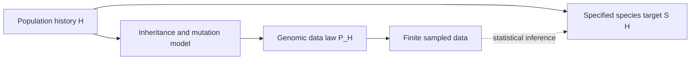

# Can DNA determine biological species?

25 September 2026. **Rapid evidence map and a bounded formal follow-up.** This responds to the proposal to prove that DNA determines biological species. It preserves the ambition while distinguishing several mathematical questions. It is not an exhaustive literature review or a claim that no other identification theorem exists.

## The answer in ordinary language

Genomic data can be highly informative, and substantial identification theory already exists. The unqualified sentence "DNA determines species" does not specify one theorem: the observed data, the species concept, and the class of allowed evolutionary histories all affect the answer.

For a fixed named-species reference collection, assigning a sample is a different task from discovering species boundaries. Inferring a tree connecting already designated taxa is different again. Reconstructing the organism pedigree is another problem, and Alexander's future-inclusive specieslike property is another target. A positive result for one cannot silently supply the others.

The distinction between a species concept and evidence for its boundaries is developed explicitly by [de Queiroz (2007)](https://pubmed.ncbi.nlm.nih.gov/18027281/). Reproductive isolation, diagnosability and monophyly can be treated as evidence of lineage separation; choosing the target remains part of the scientific model.

## What is already known

| Target and observation | Established result | Scope that matters |
|---|---|---|
| Rooted species tree from the exact distribution of unrooted gene-tree topologies | [Allman, Degnan and Rhodes (2011), Theorem 9](https://arxiv.org/html/0912.4472v2) identifies the rooted topology and internal branch lengths for at least five taxa under the stated multispecies coalescent model. | The taxa are already specified. The observation is an ideal probability law, not one finite genome. Four taxa do not give the same root identification. |
| Branch lengths and a delimitation test for three or four putative taxa | [Kubatko, Leonard and Chifman (2024)](https://pubmed.ncbi.nlm.nih.gov/39216590/) prove model-based identification, derive estimators from site-pattern frequencies, and develop a hypothesis test. | The current intake verified the published abstract; it did not inspect the full final article. These are conditional coalescent-model claims. |
| Genetic population structure versus species boundaries | [Sukumaran and Knowles (2017)](https://pmc.ncbi.nlm.nih.gov/articles/PMC5320999/) show over-delimitation in simulations separating population splitting from speciation completion. [Leache and colleagues (2019)](https://doi.org/10.1093/sysbio/syy051) explain why the unobserved species-conversion labels cannot be recovered when they do not affect the generated sequence data. | This is a warning about a particular inference target and model. It is not a proof that all genomic species inference is impossible. |
| Pedigree reconstruction from sequence-generating laws | [Thatte and Steel (2008)](https://www.math.canterbury.ac.nz/~m.steel/Non_UC/files/research/pedigree3.pdf) provide both nonidentifiable examples and positive reconstruction under a specially constructed stochastic process. [Thatte (2013)](https://arxiv.org/abs/1008.0153) proves partial identification under a recombination-mutation model. | The 2008 positive theorem requires sufficiently large alphabet and sequence length and specific automaton conditions; it is not a fixed-four-letter universal DNA theorem. The 2013 result identifies specified combinatorial invariants under its assumptions, not every general pedigree. |

These results make a simple "nobody has proved anything like this" premise untenable. They also show why a broad "DNA can never identify ancestry" assertion would overreach.

## The direct connection to Alexander

Alexander defines specieslike clusters using organism genealogy in an infinite biosphere, with past, present and future organisms. He explicitly distinguishes genealogical ancestry from genetic ancestry and cites [Gravel and Steel (2015)](https://www.math.canterbury.ac.nz/~m.steel/Non_UC/files/research/ghosts.pdf). Their biparental model permits genealogical ancestors of every present organism that contribute genetic material to none of them. See [Alexander, Sections 2 and 3.1](https://arxiv.org/html/2602.05274v1).

**This distinction is already recognized in his paper.** The useful contribution would be a precise bridge from a specified genetic observation model to one of his graph properties, or a precise obstruction showing which information is missing.

The ghost-ancestor result alone does not prove that every species-related function of a pedigree is unidentifiable. A target can be recoverable even when the whole underlying history is not. Conversely, reconstructing a past pedigree does not automatically determine an infinite future-dependent property.

## A precise target for new work

Let $`H`$ range over a biologically specified class of histories. Write $`P_H`$ for the probability law of the allowed genomic observations, and $`S(H)`$ for a specified species-related target. Statistical identification asks whether

```math
P_{H_1}=P_{H_2}\quad\Longrightarrow\quad S(H_1)=S(H_2).
```

This is a property of the model and target. It is distinct from requiring one finite observed dataset to return the correct answer with certainty.



The central candidate research question is:

> Under a specified recombination, mutation and reproduction model, which specieslike properties are constant across all histories that generate the same genomic data law?

There are two informative outcomes. A positive theorem identifies assumptions that make recovery possible. A counterexample consists of two admissible histories with the same data law and different target values. Merely assigning two arbitrary species labels to identical data would not be a biological result: the target must be independently defined and the histories must satisfy the chosen model.

For Alexander's original infinite target, the history class must also constrain future reproduction. In a model where the observation law depends only on the observed past, two allowed futures with different target values immediately obstruct identification. Our existing finite-completion result is an abstract version of this issue; it does not yet include a genetic inheritance model.

## Immediate formal step

The accompanying formal work addresses the gap between the repository's exact three-taxon law and finite observations of already reconstructed gene-tree topologies: perfect finite-data recovery can fail even when the ideal laws identify the parameter, while a sufficiently small estimation error preserves a uniquely separated maximum. See the [formal scope and receipt](FORMAL-SCOPE.md) for the exact checked statements and assumptions.

This is a known statistical distinction made explicit and auditable. It does not define species by an assumed label, prove the stochastic coalescent derivation, or establish a new biological species classifier.

## How this could help the research

A successful observation-to-specieslike theorem could make the graph framework more testable: it would say which measurements carry information about which proposed species properties. An obstruction can be useful too, by showing when ecological, reproductive, spatial or longitudinal evidence is needed. The value depends on a defensible biological model, not merely on obtaining another Lean certificate.

The priority after this bounded step is to choose one target and one inheritance model, compare with the pedigree-identifiability literature, and test the exact identification implication above. No claim that the general biological species problem has been solved accompanies this note.

## Evidence and limitations

The [evidence ledger](dna_species_evidence_ledger.md) records primary sources, exact statements, identifiers and scope limitations; `search-protocol.json` records the bounded question and root searches. Full texts were used for the decisive mathematical and model-comparison claims. The 2024 speciation-time item is explicitly abstract-only. Some PMC/publisher requests were inaccessible through the retrieval tool. No database-exhaustive or worldwide-priority claim is made.
