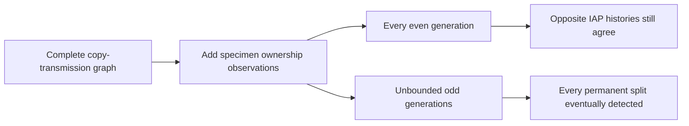

# Which ownership observations identify long-term ancestry?

This bounded Q2 extension reuses the frozen eight-copy construction owned by the separate genome-pedigree lane. Its new question is which additional ownership observations distinguish the constructed histories. The proof is an elementary, exact deduction in that model; no priority or biological reconstruction claim is made. Verification status and exact commits are recorded in the checkpoint and ledger.

## The observation we actually assume

The complete realized genome-copy transmission graph, its copy identities, times and intervals are already known, as in Q1. The missing information is which two contemporaneous copies belong to an organism. Additional data consist of accurate specimen ownership labels at a fixed, known set T of sampled generations. At each sampled generation, retain one bit: do the copies on named lanes 0 and 3 belong to the same organism? Missing data is `none`; an observed negative answer is `some false`.

This is a static selection from an already realized history. A serial archive can repeat the same observation type at different generations, but the selection rule here is prescribed in advance: it is neither adaptive nor an intervention on past reproduction. The metadata is noiseless and supplies persistent copy correspondence. Phasing or equality of DNA letters alone does not supply that information. An unlimited observation record is a mathematical limit, not an attainable finite dataset.

The candidate class is also fixed. The mixing history alternates matchings M0 and M1 forever. A delayed-splitting history agrees through an even generation S >= 2, then alternates M0 with M2. The imported Q1 theorem proves IAP for mixing and its failure after any such split, using Alexander's actual predicate. Both histories satisfy the stated diploid and parent/child constraints.

## The exact criterion

Within this class, the observed co-ownership bit is false throughout mixing. After a split at S it is true exactly at odd generations later than S. Consequently the full observation record identifies IAP if and only if sampled odd generations are unbounded:

```math
\mathrm{IdentifiesIAP}(T)
\quad\Longleftrightarrow\quad
\forall N\ \exists t>N:\ t\in T\ \land\ t\bmod 2=1.
```

If this condition holds, every split eventually yields an observed positive bit. If it fails, put the permanent split beyond the last informative sample. The resulting complete observations agree with mixing, although IAP differs. The formal decoder consumes an infinite observation function and returns a proposition; it is not a uniformly terminating decision algorithm.



Infinitely many observations alone are insufficient. Indeed, the entire owner assignment at every even generation agrees between the histories, so this failure is stronger than merely overlooking one co-ownership bit. Conversely, arbitrarily sparse unbounded informative samples suffice for this infinite-record target. The target is IAP status, not the exact switch time or a complete reconstructed pedigree.

## What finite data can establish

An observed positive bit certifies the splitting branch within the assumed family. Any finite collection of negative answers remains compatible with a later split. Q1 already supplies the stronger finite-prefix ownership obstruction; this packet does not reimplement it.

A conditional Q3 corollary makes the missing assumption explicit. Suppose an even bound B >= 2 is known in advance such that any permanent split must occur by B, and the history is otherwise mixing. Then a sampling set identifies IAP exactly when it contains an odd generation later than B. In particular one exact query at B+1 suffices. This is a minimal observation condition within that bounded class. The class restriction and future switch bound are additional prior assumptions; the finite observations do not establish them. No finite-data transfer to arbitrary pedigrees is asserted.

## Relation to the existing work

The finite-family recovery theorem remains a positive control for a different, explicit independent-block observation law. It neither supplies this ownership oracle nor the delayed-split assumption. The twin-pair thought experiment reinforces why observed sequences, copy transmission, and specimen identity must remain separate; no twin model is proved here. Real monozygotic twins can differ in postzygotic and germline mutations.

The [prior-work comparison](PRIOR-WORK.md) separates established pedigree ambiguity and finite-prefix monitoring facts from this exact model-specific criterion. The [claim ledger](LEDGER.json) records what has been formalized. The [checkpoint](CHECKPOINT.md) records verification and any remaining gates. Stop this lane after this criterion, its finite-bound corollary, independent review and exact verification; do not expand to noisy/adaptive sampling or biological species without a new concrete question.

## Reproduce the accepted gate

From a clean checkout, set the shared compiler lock before running:

```powershell
$env:WONG_COMPILER_LOCK = 'C:\Users\Owner\Documents\Codex\2026-09-27\wong-alexander\.local-build\wong-continuation\compiler.lock'
python -X utf8 research/wong/continuation-2026-09-27/check.py PairingObservationAudit --require-clean --recheck-targets
```

The checker pins Lean 4.33.1 and the recorded official package cache, validates dependency sources/objects/logs, and recompiles the requested audit. Add `--force` to rebuild all five project modules in this closure. The new source itself imports only the Q1 core and its two standard-library Alexander dependencies.

Once the final receipt is present, `python -X utf8 research/owner-observations/verify_packet.py` checks saved-evidence hashes, exact committed sources and all 20 selected axiom reports. It does not itself invoke the Lean kernel. Fifteen selected declarations belong to this extension; five are reused Q1 endpoints. Earlier ARG and finite-family audits are separate.
