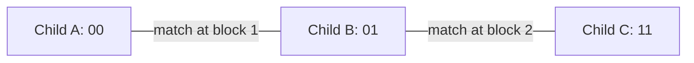

# Recovering sampled families from independent inheritance blocks

This is a separate one-generation specialization motivated by Kim, Mossel, Ramnarayan and Turner. Its verification status and exact source commit are recorded in `verification/RESULT.json` when the combined gate finishes. It does not replace the earlier marked-ARG checkpoint or claim the full REC-GEN theorem.

## What is being recovered

Suppose several sampled children have parents drawn from disjoint parental pairs. At each observed block, every parent has a distinct symbol. Each child independently copies either parent's symbol with probability one half, separately in every block. We see the children's symbols exactly, but do not know their family assignments.

Join two children when their symbols match in any block. The connected components of that graph are the proposed sampled families. Different families can never be joined under the distinct-symbol assumption. A true family may still split into several components because its sampled children happened not to share enough inherited symbols.



Here 0 and 1 stand for one family's two parental symbols. All three children are connected, although no block is shared by all three. This explains why pairwise connections can do better than requiring shared triples in this restricted model.

## The exact statement

For every finite collection of nonempty sampled families, let family i contain m_i children and let B >= 1 be the number of blocks. The proposed partition equals the true sampled-family partition with probability

```math
\prod_i\left[1-(2^{m_i-1}-1)2^{-B(m_i-1)}\right].
```

A family becomes disconnected precisely when all its children's binary inheritance vectors occupy one complementary pair, with both vectors occurring. Counting those configurations gives the formula. Single-child families always form the correct component. The Lean notation uses m_i = n_i + 1, so no positivity assumption is hidden in natural-number subtraction.

For three siblings and two independent blocks, the success probability is 13/16. The initial all-three-sharing rule succeeds with 7/16. This comparison concerns those two restricted procedures, not the full REC-GEN algorithm or statistical optimality.

The formal target is the actual connected-component relation of observed symbols. The model's hidden family labels appear in the correctness statement, not as data used to construct sharing edges. A separate output-law theorem maps the inheritance choices to the observed symbol array and computes the recovery event there.

## Why independence and the observation model matter

Adding observed blocks can only connect more children within their true family, so correct recovery cannot be spoiled in this model. That deterministic statement needs no independence.

The probability gain does. If each child repeats the same parental choice in every block, each block separately has the correct fair-copying law, yet the additional blocks supply no new information. For three siblings, success remains 1/4 regardless of how many such blocks are observed. The dependence construction records the actual probability law and each block's full joint marginal.

Distinct parental symbols are a strong model assumption. Ordinary equal DNA letters do not automatically identify a unique parental origin. The result also assumes exact observation, disjoint parental pairs, binary copying and no mutation. It concerns a fixed one-generation sampled population; no fertility distribution or large-population limit is used.

## How it fits Wong and Alexander

The checked Wong construction describes a random history of genomic ancestry. This theorem asks a different question: what a specified observation law lets us recover about sampled parentage. A proof connecting Wong's continuous recombination process to this independent-block law has not been supplied. In particular, increasing a recombination parameter is not the same mathematical operation as adding independent observations.

Even perfect recovery of these finite sampled families does not determine Alexander's infinite identical-ancestor behavior, ancestry convexity, maximality or specieslike clusters. The earlier owner-map assumptions and infinite-completion counterexamples remain in force. No biological species classification is made.

Kim and colleagues' [Theorem 6.1](https://arxiv.org/pdf/2005.03810v1) gives an asymptotic multigeneration reconstruction guarantee in its specified model. We use a narrower founder-generation model and a different elementary estimator. The [Mossel-Vulakh follow-up](https://arxiv.org/pdf/2204.04573v2) studies simulation performance and heuristic improvements; those experiments were not rerun here.

A bounded [prior-formalization check](source/PRIOR-FORMALIZATION-CHECK.md) identified no public machine-checked proof of the full REC-GEN theorem in the sources inspected. That is not a worldwide absence or first-formalization claim.

## Proof and evidence map

- `PedigreeBlockModel`: inheritance arrays and explicit graph events.
- `PedigreeBlockGraph`: exact disconnection characterization and preservation under additional blocks.
- `PedigreeBlockProbability`: finite bijection, exact event mass, and proved independent coordinate and family laws.
- `PedigreeBlockObservation`: observed-symbol equality, family-preserving paths, and actual partition recovery.
- `PedigreeBlockRecovery`: exact recovery probability, including the observed-output law.
- `PedigreeBlockDependence`: repeated-block law and unchanged one-block marginals.

The [claim ledger](LEDGER.json) separates checked endpoints, written-only extensions and source correspondence. The [checkpoint](CHECKPOINT.md) records any remaining gates. The [written precursor](source/written-precursor/RECOVERY-THEOREM.md) and finite controls are preserved as development evidence; their historical status is not a substitute for the final Lean receipt.

## Reproduce the checks

From the repository root, inspect the saved evidence with:

```powershell
python -X utf8 research/pedigree-block/verify_packet.py
```

This checks the committed source bytes, compiler-log hashes and all 31 selected axiom reports. It does not run the Lean kernel. For a fresh compiler check at a clean checkout, use the pinned Lean and Mathlib paths documented by the checker:

```powershell
$env:WONG_COMPILER_LOCK = 'C:\Users\Owner\Documents\Codex\2026-09-27\wong-alexander\.local-build\wong-continuation\compiler.lock'
python -X utf8 research/wong/continuation-2026-09-27/check.py PedigreeBlockAudit --require-clean --recheck-targets
```

Dependency reuse requires matching source, direct dependency object, compiler, Mathlib, object and raw-log hashes. Add `--force` to rebuild this entire seven-module closure. The prior 415-declaration ARG audit remains separate.

The optional `python -X utf8 research/pedigree-block/check_recovery.py` replays the finite controls and writes an ignored `CHECK-RESULT.json`; the frozen control receipt is `FINITE-CONTROLS.json`. These finite enumerations are supporting controls, not the general proof.

This control-model lane stops at its accepted proof checkpoint. Valuable formalization remains part of the project, alongside a deliberate discovery track on new maps, preservation results and obstructions. Known-result formalization, new results supported by prior-work review, and speculative ideas retain separate labels. Publication requires a concrete reviewable artifact and a separate decision.
