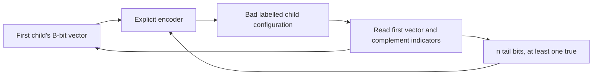

# Exact finite-family probability

This probability development is separate from the frozen continuous ARG
construction. It uses the agreed one-generation model in
`real/PedigreeBlockModel.lean`. There are n+1 labelled children, B observed
blocks, and a bit at each child/block coordinate indicating which one of
two distinct parental symbols was inherited. The exact bad-event formula
assumes B>0 and permits n=0.

The sample space is `Config n B = Fin (n+1) -> (Fin B -> Bool)`.
`configPMF` is the library's uniform PMF on this entire finite space, and
`configLaw` is its associated probability measure. Neither an exceptional
probability nor a connectivity probability is supplied as an assumption.

## Counting proof

Anchor the vector v of the first child. A bad configuration has every later
child's vector equal to v or to its coordinatewise complement, with the
complement occurring at least once. Since B>0, v and its complement differ.

The explicit `badEquiv` pairs v with a Boolean tail t on the remaining n
children. A false tail bit selects v; a true tail bit selects its complement.
The all-false tail is excluded. Encoding and decoding are inverse, including
the empty-tail case n=0, when no bad configuration exists.



There are 2^B possible anchors and 2^n-1 allowed tails, among
2^(B*(n+1)) total equally likely configurations. `bad_card` proves the count,
and `bad_probability` derives the measure formula by evaluating the actual
uniform measure and cancelling the positive finite factor 2^B:

```
configLaw n B {x | Bad x} = (2^n - 1) / 2^(B*n).
```

The Lean codomain is ENNReal. The numerator is the natural number 2^n-1
cast into ENNReal, so the singleton-family case is exactly zero. The block
positivity hypothesis must remain visible: with zero blocks the complement
operation has a fixed point and this bijection does not apply.

## Independence and several families

`uniform_pi_event` proves that uniformly sampling a finite dependent function
space gives the product probability for arbitrary coordinate predicates.
Its proof counts the constrained function subtype via the equivalence with
the product of coordinate subtypes. It does not assume independence.

`config_bit_cylinder` applies this result twice and proves factorization for
every child/block coordinate-event cylinder. `fair_bit_singleton` gives each
Boolean value probability 1/2. These statements verify the independent fair
bit interpretation of `configLaw`.

For an arbitrary finite index type of families and n(i)+1 children in family
i, `familyLaw n B` is uniform on all families' configurations at once.
`family_event_product` derives independence for arbitrary within-family
events. Combining it with `good_probability` gives

```
familyLaw n B {x | forall i, not (Bad (x i))}
  = product_i (1 - (2^(n i)-1) / 2^(B*n i)).
```

The graph lane proves the equivalence between the bad event and disconnected
within-family sharing. The observation lane separately proves that the
connected-component estimator on actual block symbols recovers all sampled
families exactly when every within-family graph is connected. Those are
deterministic interfaces, not extra probabilistic assumptions in this file.

No inference about infinite ancestry, Alexander specieslike clusters, or
biological species follows from this finite sampled-family theorem. The
independent-block law has not been derived from the marked ARG law. Distinct
parental symbols, the one-generation family structure, exact observations,
and independent blocks remain explicit model assumptions.

## Verification

The complete probability module passed in 24.052 seconds, with the default
heartbeat limit. Its two-module project closure contains the common model
and this probability module. All 12 printed endpoints depend only on
`propext`, `Classical.choice`, and `Quot.sound`; the successful log has no
warnings, `sorryAx`, or `Lean.ofReduceBool`.

The preserved artifacts are `module-receipt.json`, `compiler.log`, and the
target-specific `closure-receipt.json`. Source SHA256:
`0ba98d4cc1c25f684f0808222370ffcc8b2dd85a8935fce6baeefa98b5a9a7b8`.
Object SHA256:
`21dadba8ebbc5f8882d0c4657fb19b8a91d19b78a64545f2dd6b07b20e69d653`.

An elaboration issue was resolved by exposing `DecidableEq` on the index
of the generic `uniform_pi_event` lemma. The pinned function-space Fintype
instance depends on that equality instance. Making it explicit aligns the
generic lemma with concrete finite index types without unfolding different
enumerations. No extra axiom or enlarged heartbeat limit is used.

The owning root lane registers the combined results and verifies an exact
commit. Local module verification uses the shared serialized compiler:

```powershell
$env:WONG_COMPILER_LOCK='C:\Users\Owner\Documents\Codex\2026-09-27\wong-alexander\.local-build\wong-continuation\compiler.lock'
python -X utf8 research\wong\continuation-2026-09-27\check.py PedigreeBlockProbability
```

The preserved receipts bind source and object hashes to Lean 4.33.1
and the pinned Mathlib revision. A working-tree module check is distinct
from the final exact-commit combined verification.
