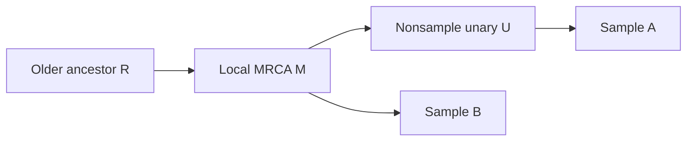

# From sampled ancestry to a canonical finite graph

The new deterministic result combines three operations from Wong et al.'s
representation of ancestral recombination graphs: stop above a local common
ancestor of all samples, bypass nonsample unary paths, and merge touching
inheritance intervals. The result is an actual finite interval gARG with the
specified local edges and retained sample identities.

This is attributed formalization of known operations, with reusable
representation proofs. It is not a claim of new biology or completion of the
whole paper. The [current coverage table](COVERAGE.md) retains all 52 claim
families from the main text and Appendices A–I.

## A small example

At one genomic position, suppose the sampled genomes are **A** and **B**:

Every edge is ancestral to a sample, so ordinary sample-support filtering
retains them all. The stronger stopping rule removes the edge from R into M:
M already carries ancestry of both samples. The subsequent contraction
bypasses U, leaving the two local edges M→A and M→B. The catalogue still
contains R and U as isolated IDs; the construction preserves the input IDs
instead of renumbering the graph.

Interval storage then removes redundant subdivision. For one fixed
parent–child pair, `[0,1)`, `[1,2)`, `[2,3)`, and `[5,6)` become `[0,3)` and
`[5,6)`. The genuine gap remains. That interval example is kernel-checked in
`WongIntervalCanonicalization.executable_touching_gap_example`; the diagram
is an explanatory example of the general graph theorem.

## What the theorem says

Let **G** be a finite acyclic gARG, with persistent node IDs, a designated
sample set, and proper half-open intervals in a linearly ordered coordinate
space. At each coordinate, the pipeline first retains exactly those edges
whose child reaches at least one sample but is not an ancestor of every
sample. It then contracts paths through nodes that are neither samples nor
local branching points.

`WongSimplificationNormalForm.canonical_resolved_normal_form` proves the
existence of a finite interval gARG **H** with all of the following properties:

- H has the original sample set and the same node type. Its local edges are
  exactly the stated contraction of the truncated sample ancestry.
- At coordinates where G has at most one parent per child, so does H, and
  every **incident nonsample** node in H has at least two distinct children.
- Sample-to-sample paths remain. Paths from a local MRCA to the samples
  remain when the samples are nonempty and that MRCA satisfies the stated
  common-ancestor property.
- Every retained edge is supported by a sample in H itself. Each active
  parent–child pair has one nonempty record, its annotation intervals are
  strictly separated, and no new coordinate endpoint is introduced.
- Canonicalizing H's interval storage again produces exactly H.

The final clause is a storage fixed point. A second run of the entire
truncation-and-contraction pipeline is not covered by that clause.

The separate MRCA theorem requires nonempty samples, unique local parents,
and at least one common ancestor. Forests without a common ancestor are not
silently treated as coalesced. With one sample, the sample itself is the
reflexive MRCA and there are no retained edges. Empty samples also produce
no retained edges. A sample that is itself ancestral stays protected and
may remain unary; unused catalogue nodes can remain isolated.

## Where this comes from

Wong et al. (2024), *A general and efficient representation of ancestral
recombination graphs*, [DOI 10.1093/genetics/iyae100](https://doi.org/10.1093/genetics/iyae100):

| Source location | Formalized operation | Scope |
|---|---|---|
| [Figure 3 and sample resolution](https://pmc.ncbi.nlm.nih.gov/articles/PMC11373519/#iyae100-s3), printed p. 4; [Appendix B](https://pmc.ncbi.nlm.nih.gov/articles/PMC11373519/#app2), printed pp. 12–13 | Path-defined removal of fully coalesced material | Deterministic finite-graph semantics; not stochastic count transitions |
| [Appendix E](https://pmc.ncbi.nlm.nih.gov/articles/PMC11373519/#app5), printed pp. 14–15 | Reassembly of coordinate edge relations into finite interval records | Full local relations determine the canonical record output; reconstruction from sample traces retains the `SampleSupported` condition |
| [Appendix G](https://pmc.ncbi.nlm.nih.gov/articles/PMC11373519/#app7), printed pp. 16–17 | Coordinate-dependent unary bypass | Protected samples and unused-ID exceptions are explicit; the intermediate global Figure 5c rule is a separate obligation |

The representation lemmas add precise canonical-storage contracts to these
source operations. They do not recover omitted timestamps, hidden event
partners, or intermediate genomes from simplified observations.

## Proof evidence

The three transferred modules contain **65 selected endpoints**: 24 for MRCA
truncation, 31 for intervals, and 10 for the composed normal form. Each has an
existing local Lean 4.33.1 pass. The Mathlib dependency is pinned at
`0df444a360eaa60ab8c11dca51a86af692955474`. The selected reports use only
`propext`, `Classical.choice`, and `Quot.sound`; no `sorryAx` is permitted.
The interval run has one unused-section-variable linter warning, explicitly
retained in its evidence.

The deterministic release added 65 selected endpoints to the prior 209,
yielding the hosted **274-endpoint aggregate**. That aggregate also includes
other research already in the real library. Endpoint totals are an audit
inventory, not a measure of the fraction of the paper proved.

**Local release evidence: PASS.** A fresh isolated rebuild of all 61 imported
local modules passed, followed by exactly 274 selected axiom reports. The
independent statement/source review returned **PASS WITH SCOPED LIMITS**, and
15 finite sanity and false controls passed. This deterministic release passed hosted CI at commit
`46aac52e214311fb2c2230b1b4fe37c42ef9e1a9` after a separate documentation
format transform; the proof bytes are unchanged. See the [verification guide](verification/deterministic65/README.md),
[exact aggregate receipt](verification/deterministic65/combined-real-audit.json),
and [independent review](verification/deterministic65/SOL2-REVIEW.md). Exact
module hashes and historical contracts are recorded in [coverage.json](coverage.json).

## What remains

The list merge is executable Lean. The full gARG construction uses classical
finite enumeration and arbitrary activity predicates, so it is a mathematical
representation theorem rather than an executable whole-graph exporter.
Concrete table emission, a parser/byte format, tskit conformance, and machine
runtime bounds remain open.

The probability lane remains separate: holding times and nonexplosion,
spatial projection/coupling of Big and Little ARGs, lineage sample-partition
invariants, and expected cost still need their own exact statements and
checks. Any count-chain absorption result must name its path law and cannot
by itself close those obligations. The existing rate-normalization issue
also remains visible in the coverage ledger.

This result supplies a precise target for those later implementations:
which local edges they must produce, which paths they must preserve, which
information they intentionally remove, and what canonical interval output
means.

A separate [count-process candidate](probability/CANDIDATE-STATUS.md) proposes
19 additional endpoints. Its source and statement reviews passed with scoped
limits; pinned combined verification remains pending because the historical
donor cache lacks an independent acquisition record and the lead retry
encountered a missing dependency. It is a discrete jump-index result and does
not construct continuous clocks. The deterministic theorem is unchanged.
