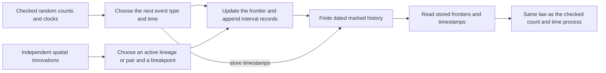
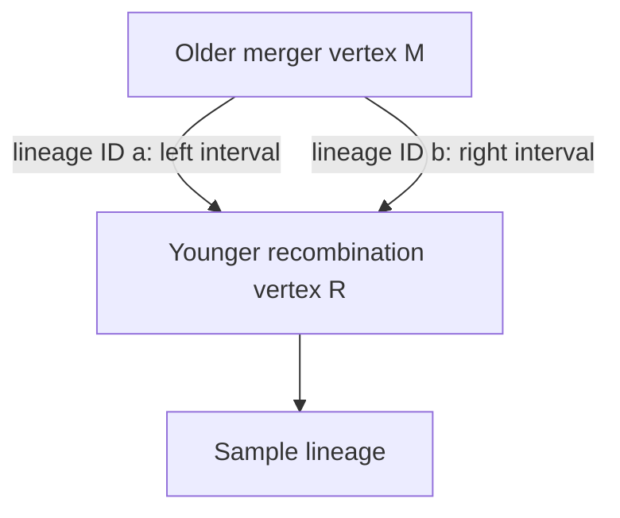

# From a recombining genome history to an organism ancestry model

This continuation starts from research branch commit
`01db8c4cbb82000950ff7d3e7252b5438416c7c3` and the current public progress
report (GitHub blob `cc07be5e143938e935197ddfb962b9e046f4fed5`). The prior
hosted probability checkpoint is `a2644182b147eb40816abb278e00c3c6d4709eb8`.
The original checkout and other research branches are preserved. This chat
and its research history remain unarchived.

The two main questions are different. Wong and colleagues describe how to
record the ancestry of genome copies and their intervals. Alexander studies
ancestry among organisms, including their indefinitely continuing future.
The work here makes the first description more complete and states exactly
which deductions can cross from one description to the other.

## Reading this with no biology background

Imagine a chromosome as a long strip of numbered paper. A lineage is a pending
request to find the older source of one part of that strip. It has its own ID.
It is not simply a pair of dots joined by a line.

Looking backward in time, a recombination splits one pending lineage into two,
with the left and right parts assigned to different older sources. A common
ancestor event merges two pending lineages into one. In the paper's **Big ARG**,
the newly created ancestral genome is still a whole genome. We must not quietly
discard a split just because its position lies outside the material inherited
by the chosen samples. That discarding belongs to a different construction.

`WongMarkedDated.history_count_time_projection` receives only the stored dated
history. It counts actual generated frontier identities and reads the retained
timestamps; its law is exactly the previously checked count-and-time law.
An undated final graph cannot recover elapsed time: changing only the clocks
leaves that graph unchanged. The dated representation therefore keeps the
finite history explicitly, as snapshots with a constant terminal tail. It is
redundant, and carries no claim of efficient serialization.

Malformed starts, nonhitting count paths, and invalid consumed transitions
retain an explicit failure result. Unused mark components and post-stopping
tails are deliberately ignored. Clock positivity is proved almost surely
under the probability law; it is not a raw-parser validation rule.

## Why the decoder repair matters

The paper's uniform merger rule permits the two branches of a recombination to
meet again at the very next event. Both resulting records can have the same
older and younger vertices while still being different lineages and covering
different intervals.

Keeping the raw interval records preserves the breakpoint. Replacing the two
records by their union loses it. The old decoder theorem required distinct
parent endpoints. The new `raw_records_injective` and `rawEncodingEquiv`
remove that restriction for the raw encoding range. This is a mathematical
inverse; it is not a general file parser. The recorder's invariant also proves
that its distinct completed lineage slots cannot collapse into one identical
raw interval record.

## What probability is being specified

With k active lineages, merger rate is k(k−1)/2 and recombination rate is kρ.
Each active lineage has equal split probability; each unordered pair has equal
merger probability. The continuous-coordinate specialization takes the cut
uniformly inside (0,L), with probabilities determined by interval length.
An array of independent marks is indexed by event number and the possible
finite frontier. The recorder reads the entry for its current frontier.

The **adaptively selected** entry has its proved conditional law for the actual
recorder, in `WongAdaptiveSelection.recorder_mark_cylinder`. Adaptedness is
derived from the recursive updates: only earlier innovation rows can affect
the frontier. `WongMarkedMeasurable` also proves that the full graph-valued
output is measurable in its natural numerical encoding, with ordinary Borel
real coordinates. These close separate obligations that fixed-coordinate
uniformity and a count-only theorem could not settle.

`WongMarkedSupport` proves that validity itself is Borel measurable, despite
quantifying over every real genome position. `WongDatedSupport` then proves
almost-sure validity directly under the output history law. The
[support explanation](recorder/SUPPORT.md) records the checked rational-witness
proof and the independent [side-chat endpoint argument](side-validity/PROOF-HANDOFF.md).

For every finite initial n>0, the marked recorder stops at one lineage after
finitely many actual events and in finite physical time almost surely. At
n=1 it stops immediately, and zero recombination is included. These are
general process theorems; the small reunion example is a decoder control.

The paper's Big-ARG prose uses an interior uniform cut, while its discrete-site
examples use links between sites. These are different measures. The present
Lebesgue specialization does not claim to reproduce a discrete figure.
[Exact source convention and controls](source-audit/APPENDIX-B-CONTRACT.md).

## What reaches Alexander's organism model

Someone must supply an **owner map** saying which organism owns each genome
state and justify that every recorded genetic edge follows organism ancestry
(or stays within one organism). This preserves positive ancestry evidence.
It does not recover unsampled organisms, parenthood that left no retained DNA,
missing intermediate generations, or the indefinite future.

The new bridge proves conditional transfer theorems for the identical-ancestor
property, ancestry-convex sets, specieslike clusters, and appropriate maximal
clusters. It also proves counterexamples to transferring them from soundness
alone. A separate extension shows that the identical-ancestor property is
unchanged by finitely many ancestry-relation errors in each ancestor's row;
that condition is about the transitive ancestry relation, not merely a finite
number of edited parent edges. The [robust owner-map theorem](bridge/ROBUST-IAP.md)
combines these two arguments: IAP still transfers when each representative
has only finitely many ancestry disagreements with the organism model. Exact
ancestry reflection can therefore be weakened for IAP. The corresponding
convexity or specieslike conclusion does not follow from that weakened
assumption alone.

For the exact assumptions, proofs, prior literature, and a second pair of
diagrams, read [the organism bridge explanation](bridge/EXPLANATION.md).
These graph predicates are not a biological species classification.

## Evidence and remaining source coverage

- [Source audit of all 52 claim families](source-audit/BASELINE-AUDIT.md)
- [Machine-readable baseline inventory](source-audit/baseline-claim-audit.json)
- [Recorder proof and controls](recorder/README.md)
- [Adaptive probability review](source-audit/MARKED-LAW-REVIEW.md)
- [Bridge theorem/source ledger](bridge/ledger.json)
- [Exact proof checkpoint and shortest next routes](CHECKPOINT.md)
- [Combined verification receipt](verification/RESULT.json)
- [Current source-family coverage](../completion/COVERAGE.md)

The existing source ledger still separates Little-ARG construction/coupling,
event-growth estimates, algorithms and serialization, and empirical figure or
software reproductions. A new proof of the marked Big ARG does not certify
those other families or all of the paper's cited literature.

## Reproduction

Portable integration uses the repository's pinned Lean 4.33.1 and Mathlib
`0df444a360eaa60ab8c11dca51a86af692955474`. On this Windows host,
`python -X utf8 research/wong/continuation-2026-09-27/check.py RealAudit --require-clean --recheck-targets`
rebuilds the requested project import closure in a private output directory.
It verifies the existing Mathlib pin and tracked cleanliness, checks source
and dependency hashes before reusing any project object, and serializes
compiler processes using an OS lock. It never borrows previous project
objects from another checkout. Final raw logs and named development-failure
records are retained; a successful log is not substituted for source correspondence. The
portable repository route is `python3 checks/audit_lean.py --real`, after the
pinned Lake dependencies are prepared. This continuation adds its modules and
selected endpoints to that existing audit.
