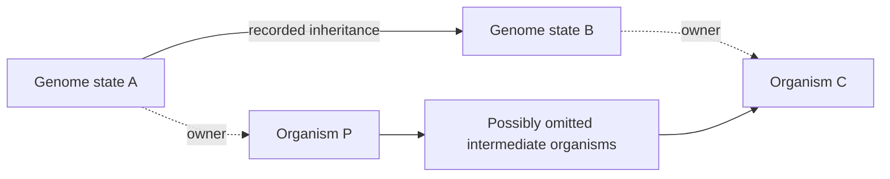
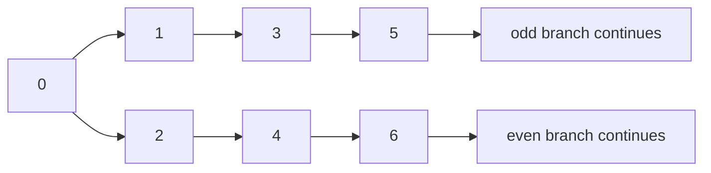

An ARG can tell us how recorded pieces of DNA travelled. Alexander's model
asks about parenthood among organisms, including organisms that contributed no
recorded DNA and organisms born arbitrarily far in the future. The bridge
between these questions is a supplied correspondence with explicit proof
obligations.

The new file is `real/WongPedigreeBridge.lean`. Its results are mathematical
deductions from the interfaces below. They are not additional theorems claimed
by Wong or Alexander and carry no claim of biological species classification.
Compilation status is recorded separately in `CHECKPOINT.md` and the combined
verification receipt, rather than inferred from the presence of Lean source.

**The two kinds of history.** A genomic node represents a genome copy or a
recorded genome state. An organism can own more than one such node. A recorded
edge can skip intermediate generations; cell-level inheritance can stay within
one organism. This motivates a function `owner` and the condition that every
genomic edge becomes either equality of owners or an organism ancestry path.
Wong's representation also separates interval-labelled inheritance from its
unlabelled topology. [Wong et al., Genome ARGs paragraphs 1/3/4/5 and Appendix D paragraph 1](https://doi.org/10.1093/genetics/iyae100)

The lower path can have zero steps when P and C are the same organism. It may
have many steps when the genomic representation has compressed the history.
The existing checked `HistoryProjection.path_projects` and
`WongGARG.GARG.locus_path_projects` prove that this condition on edges extends
to every recorded path. Distinct endpoint owners guarantee a nonempty
pedigree path.

What this map preserves is the truth of each recorded positive ancestry claim.
What it forgets includes genomic coordinates, copy identity, recombination
locations and counts, and which within-organism event occurred. Conversely,
the ARG may never have recorded the additional parenthood paths, lost genetic
contributions, unsampled organisms, or future descendants needed to reconstruct
the pedigree. Mapping event times to organism birthdates is another obligation;
the two clocks are not generally equal.

Under vertical inheritance, an appropriate biological history can justify edge
soundness. If horizontal transfer is included, the pedigree's definition of
parenthood must include the relevant donor relation or soundness may fail.
Neither a bare finite DAG nor a list of intervals proves its own owner map.

**The exact Alexander predicates used here.** His biosphere is infinite, with
real birthdates, earlier parents, finitely many births before each date, and
finitely many children per organism. A candidate has IAP when each member has
either finitely many descendants or finitely many non-descendants inside it.
A specieslike cluster is weakly connected, has IAP, and contains every organism
lying ancestrally between two members. These are graph predicates rather than
an empirical species assignment. Alexander explicitly distinguishes genetic
from genealogical ancestry. [Alexander, Definitions 1–4 and section 3.1](https://arxiv.org/html/2602.05274v1)

For the proofs, arrows always run from ancestor to descendant. Let R be the
rich-history graph, E the organism graph, q the owner map, S an organism set,
and T = q⁻¹(S) all rich nodes owned by S. A crucial distinction is that R's
ordinary transitive closure is the ancestry being discussed. If R is the ARG
topology after erasing coordinates, a path may switch loci between steps. It
does not automatically describe one DNA segment's uninterrupted inheritance.
The existing `AncestryViews.erasure_converse_fails` checks that distinction.

**A transfer theorem that actually works.** Assume:

1. Every organism is represented by at least one rich node: q is onto.
2. Each organism owns finitely many rich nodes; no common numerical bound is
   required.
3. For rich nodes a and b with different owners, a reaches b in R exactly when
   q(a) reaches q(b) in E. Both directions are required, for every pair of
   representatives.

Then `iap_iff` proves IAP(R,T) if and only if IAP(E,S).

Here is the proof. A finite set of organisms has a finite preimage because it
is a finite union of finite owner fibres. The converse holds because the image
of a finite set is finite and q is onto. Fix a rich node a. Outside the finite
fibre of q(a), assumption 3 makes the descendant sets agree under q. Thus the
two descendant sets differ only by finitely many rich nodes. Their finiteness
agrees. The same is true of the non-descendant sets. The disjunction defining
IAP therefore agrees for a and q(a), and surjectivity supplies a representative
for every organism. This is the full proof; no random mating or two-sample
example is used.

Assumption 3 is deliberately strong. Diploid copies often have different
genetic histories, so even comprehensive sequencing does not automatically
make them interchangeable ancestry witnesses. Ordinary sampled ARGs also
fail assumption 1 for an infinite biosphere. These are conditions to establish
in a model, not consequences of Wong's finite representation.

The file proves additional transfers:

| Predicate or feature | Valid conclusion | Additional requirement |
|---|---|---|
| Finiteness and infinitude | Equivalent on S and q⁻¹(S) | Onto map and finite fibres |
| IAP | Equivalent | Assumptions 1–3 above |
| Reflection, or REF | Equivalent | Assumptions 1–3 above |
| Convexity | Pulls back | Sound paths alone |
| Convexity | Descends, hence is equivalent | Onto map, assumption 3, acyclic E |
| Weak connectivity | Descends | Onto map, sound paths, convex S |
| Specieslike status of T | Descends to S | Assumptions 1–3 and acyclic E |
| Specieslike status | Equivalent on saturated sets | Also connected owner fibres |
| Common-ancestor property | Descends | Onto map and sound paths |
| Maximality among saturated rich candidates | Equivalent to pedigree maximality | Specieslike-equivalence assumptions |
| Full rich maximality of T | Descends | Specieslike-equivalence assumptions |

REF, used in Alexander's existence results, requires each member with infinitely
many global descendants to retain infinitely many within the candidate. The
same finite-preimage argument compares both infinitudes. His additional
common-ancestor property has a one-way transfer because different rich nodes
of a single organism need not have a common rich ancestor inside that fibre.
[Alexander, Definitions 8–9 and section 6](https://arxiv.org/html/2602.05274v1)

To obtain full specieslike equivalence, one sufficient extra condition is that
each owner fibre is weakly connected within itself. Target edges can then lift
between representatives under assumption 3, and target reflexive steps can
move within a fibre. Convexity keeps these lifted paths in T. The new
`specieslike_iff` formalizes this argument. `maximal_saturated_iff` then proves
an exact maximality correspondence within saturated sets T = q⁻¹(S), since
surjectivity makes inclusion correspond in both directions.
`maximalSpecieslike_descends` additionally proves that full rich maximality of
T implies target maximality. The reverse would need a reason that arbitrary
rich specieslike extensions can be replaced by saturated specieslike
extensions; it is not asserted. To transfer the full biosphere hypotheses,
separately supply the
organism birthdates, their finite sublevels, and finite organism child sets;
ancestry-preserving paths alone do not preserve immediate child counts.

**An infinite counterexample: even fixed owners do not determine IAP.** Take
the same countable rich history in both interpretations:

Interpretation B uses exactly these parenthood edges. Organism 1 has infinitely
many odd descendants and infinitely many even non-descendants, so IAP fails.
Interpretation A uses the pedigree 0 → 1 → 2 → 3 → ⋯. Every rich edge is still
sound: an edge n → n+2 projects to two pedigree steps. Each organism now has
only finitely many non-descendants, so the whole population is specieslike.
Ownership is the identity in both interpretations; all fibres are singletons.
Both graphs satisfy the natural-date biosphere assumptions, and the existing
real-date bridge transports these to literal real birthdates.

`sound_projection_does_not_determine_iap` proves the combined statement using
the already checked Fork and Join constructions. It fixes an entire infinite
rich history, not just a finite observed prefix. It shows exactly why soundness
cannot replace ancestry reflection. The example is an abstract ancestry
countermodel, not a claim that both pedigrees have positive probability under
a specified diploid inheritance model.

**Two proved extensions and what they say about observation.**

The first is a robustness result. Suppose that, for each candidate member a,
only finitely many other candidate members have an ancestry answer that differs
between two histories. Then the candidate's IAP status is unchanged.
`iap_iff_of_finite_ancestry_errors` proves this for arbitrary graphs. The
exception bound can vary with a and need not be uniformly bounded. The proof
again uses stability of finiteness under a finite symmetric difference.

The hypothesis concerns completed ancestry paths. Editing just one edge can
change infinitely many path answers, so the theorem is not a general guarantee
that a few reconstruction mistakes leave IAP unchanged. It identifies a precise
kind of observation error under which IAP is robust, while leaving the task of
establishing that error model explicit.

The second concerns exact recovery. The repository already proves that a target
is exactly recoverable from an observation precisely when it is constant on
every observation fibre. It also proves that every finite gARG has two abstract
infinite graph completions with opposite whole-population specieslike status.
The new `no_specieslike_recovery_from_garg_coarsening` composes these results:
every deterministic summary of that finite gARG has the same obstruction over
this completion class. Extra compression or fewer observed coordinates cannot
remove an ambiguity already present with the entire finite gARG.

This quantifies over topology-compatible abstract completions. It does not
establish identical DNA distributions under a population-genetic model.
Statistical identifiability from a full distribution, posterior estimates under
demographic assumptions, and universal exact decoding from a finite observation
are different mathematical questions.

**Prior work sets the scope.** Gravel and Steel prove, in a specific random
biparental model with recombination, the occurrence of ancestors of the whole
present population that leave no inherited material in it. Their result is a
probabilistic biological-model theorem; this file does not reprove it.
[Gravel and Steel, Proposition 2.1 and section 2](https://www.math.canterbury.ac.nz/~m.steel/Non_UC/files/research/ghosts.pdf)

Thatte studies identifiability from the joint distribution of extant sequences
under explicit recombination/mutation models. His Proposition 4.6 uses
dependence between sites to distinguish examples, and Theorem 5.13 extracts
counts of certain spanning-subgraph sequences under parameter restrictions.
Thus recombination can make some pedigree features distinguishable when the
observation is sufficiently rich and its probability model is specified.
Our universal completion obstruction does not contradict those results.
[Thatte, Proposition 4.6, Theorem 5.13, and section 6](https://arxiv.org/pdf/1008.0153)

The next model-dependent route is consequently concrete: choose a class of
pedigrees and inheritance laws, define its observation distribution, and test
whether the intended cluster predicate is constant on fibres of that
distribution-valued map. A positive answer needs a proof of fibre constancy;
a negative answer needs two admissible model histories with identical
distributions and different cluster status. Neither conclusion follows solely
from the countable countermodel or the deterministic finite-ARG theorem.
