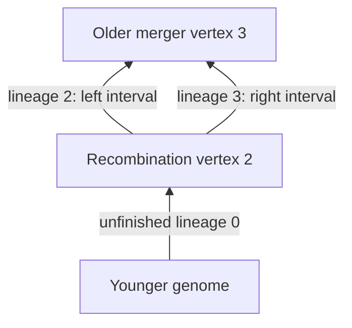
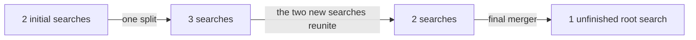

# Why a lineage is more than its endpoints

Imagine following DNA backwards through a family history. A lineage is a currently unfinished strand of that search. An edge record says which older genome supplied which part of a younger genome. Recombination creates two separate searches: one for the left part and one for the right part.

The two searches can immediately meet the same older genome. They then have the same two endpoint vertices, but they are still two different lineages, with two complementary intervals. A decoder that insists their older endpoint genomes differ rejects this permitted history. A decoder that merges the intervals into one full-genome edge loses the crossover position.

The checked recorder preserves the distinction with permanent lineage numbers. When a search resolves, its number, younger endpoint and interval remain unchanged; a new older endpoint is attached. New searches receive fresh numbers. The formal invariant says that at every position in every created genome, exactly one numbered slot exists across the completed edges and the unfinished searches. This is stronger than merely saying that two records point to the same older genome.

This illustration is an adversarial check, not the general result. The Lean proof covers any number of initial genomes and any finite valid sequence of splits and mergers, with cuts in any linearly ordered coordinate system. It constructs the package's actual finite ancestry graph and proves its acyclicity and unique local inheritance from that construction.

Two different crossover positions produce different raw histories in the reunion example. If we keep only the answer to “which older genome supplied this position?”, both histories answer identically everywhere. The proof therefore establishes both recovery from raw interval records and failure of recovery from that coarser description.

The unfinished search at the final root is not an additional biological event. Stopping keeps the completed graph and the recorded events exactly as they stand. With one starting genome there are no events to add.

A probability model still has to say how the searches, merger pairs, crossover locations and waiting times are chosen, then connect that random model to this deterministic recorder. A species claim requires still further assumptions about organisms and reproduction. Neither the shape of this graph nor the reunion picture supplies a biological species classification.
