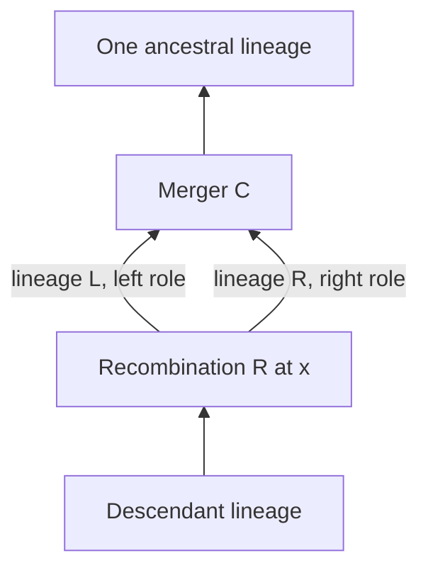

# Appendix B: source contract for the marked Big ARG

This source review fixes what a completed B04/B05 construction must mean. It
does not itself add a Lean theorem. The baseline is commit
`01db8c4cbb82000950ff7d3e7252b5438416c7c3`; the complete family inventory is in
[BASELINE-AUDIT.md](BASELINE-AUDIT.md).

The primary article is Wong, Ignatieva, Koskela, Gorjanc, Wohns and Kelleher,
*A general and efficient representation of ancestral recombination graphs*,
Genetics 228(1), iyae100 (2024), [published PDF](https://www.pure.ed.ac.uk/ws/portalfiles/portal/458588307/iyae100.pdf#page=14),
[DOI](https://doi.org/10.1093/genetics/iyae100). Exact original XML locator:
`//sec[@id="app2"]/p[5]`, equivalently
`/article/body[1]/sec[11]/p[5]`. This is journal page 13, one-based PDF page 14.
The preserved XML has SHA-256
`2b77c349f39d2885b3e36d3bcab639a7ef3b9c6217263031aa4bc8f1c2a0d05e`.
Browser PDF text and original XML/MathML were inspected. The screenshot tool
returned no visible image, so this is not a visual-review receipt.

The exact rates and stopping rule are unambiguous. MathML IM38 is a binomial
coefficient, not a fraction or a square: with k extant lineages, the merger
rate is k(k−1)/2. IM39 gives recombination rate kρ. IM40 requires an interior
breakpoint 0<x<m. Recombination chooses a lineage uniformly; common ancestry
chooses two distinct lineages uniformly. Sampling nodes start the process,
and it stops when one lineage remains. General rates a·k(k−1)/2 and b·k are a
convenient formal generalization; source specialization is a=1, b=ρ, with
normalized count parameter θ=2ρ.

| Source component | Precise obligation | What the baseline supplies |
|---|---|---|
| n sampling events | Start with n≥1 distinct sample identities and n distinct active lineage identities at time zero. | An initial count law, not the labelled nodes. |
| Each extant edge is a lineage | A finite active collection with distinct IDs; record each edge's identity and endpoint incidences. Equal event endpoints do not identify lineages. | No random labelled active collection. |
| A uniformly selected recombining lineage | For every admitted state of count k≥2, each active lineage has conditional mass 1/k. Create two fresh distinct lineage IDs with left/right roles; remove the old one. | Correct split count probability only. |
| A uniformly selected pair | Each unordered two-element subset has conditional mass 1/choose(k,2). Remove exactly the selected two and create one fresh lineage. | Correct merger count probability only. |
| Uniform interior breakpoint | State a coordinate model and prove the corresponding pushforward law. Left inheritance is [0,x), right inheritance is [x,m). | Deterministic interval encoding for a supplied cut. |
| Time of next event | Conditional wait has exponential rate q(k)=kρ+choose(k,2), independent of the event type and marks given the current state/history. | A constructed count/independent-clock product law, conditional survival cylinders, and the exact stopped holding-path observation law. |
| Event records | Add one dated event at each pre-hit jump. The selected lineages terminate there, and one or two fresh ancestral lineages begin there. Preserve sample IDs, event type, selected IDs, cut when applicable, branch order, and dates. | Deterministic supplied event graphs; no sampler-to-recording map. |
| Continue until one lineage | Active count is the constructed count trajectory, actual event index stops at its first hit of one, and no actual events are appended to the constant tail. | Almost-sure finite first-hit index and positive finite physical absorption time for n≥2; zero time for n=1. |
| Finite-time guarantee | Transfer that law and stopping theorem to the valid marked recording process for every n≥1, including ρ=0. | The transfer is missing at baseline. |

The Big process retains potential lineages with no inherited material in the
sample. A lineage formed as the left branch of an earlier split still has a
full genome on which a later breakpoint may be drawn. Restricting subsequent
breakpoints to the lineage's currently sample-ancestral support changes the
process. Discarding empty-support lineages, or stopping each coordinate at its
local MRCA, also changes the process. Those are Little-ARG concerns, not
optimizations that can be inserted without a law-preservation proof.

Uniform ordered sampling without replacement is an acceptable implementation
of the unordered pair rule only with the conversion theorem: each unordered
pair has two orders, hence mass 2/[k(k−1)]=1/choose(k,2). An ordered pair drawn
with replacement is not the source rule. An implementation must also prove
that the selected positions refer to distinct current lineage identities.

The source's independent exponential waiting-time interpretation is the
standard continuous-time jump-process reading of the stated rates. Its
explicitly stated content is the rates, choices, updates, and stopping rule;
the perspective does not present a formal transition-kernel definition.
A rigorous construction should make its conditional independence assumptions
visible rather than treat a count marginal as a unique full stochastic law.

## The genomic-coordinate convention needs an explicit choice

Figure A1's caption explicitly uses m discrete sites and depicts two events
at the same link. Appendix B's Little process is also discrete: its rate is
ρν/(m−1) (IM29) with
ν=Σ(lineage maximum right endpoint − minimum left endpoint − 1) (UM1).
The Big paragraph says uniformly 0<x<m without explicitly declaring a switch
to continuous coordinates. Thus these are two separately named versions:

| Version | Admitted genome | Breakpoint law | Distinguishing consequence |
|---|---|---|---|
| Discrete-site version, matching Figure A1 | Integer m≥2; sites represented by [i,i+1), i=0,…,m−1 | Uniform counting probability on {1,…,m−1} | The same link may recur with positive probability. A single-site genome requires a separate no-recombination convention. |
| Continuous-coordinate interpretation of the Big prose | Real m>0 and interval [0,m) | Normalized Lebesgue measure on (0,m), obtained from an independent U∼Uniform(0,1) by x=mU | Exact equality of independently sampled breakpoints has probability zero. This does not reproduce the discrete Figure A1 law. |

For either version, q(k), the event-type law, and the stopped count-and-time
law are identical at matched ρ. A useful general theorem may parameterize a
probability law supported strictly inside the genome, prove count/clock
projection without assuming uniformity, and then supply the discrete and/or
continuous uniform specializations. The generic theorem alone does not close
the source's uniform-breakpoint requirement.

## The decoder must preserve lineage identities

At baseline, [Normalized](https://github.com/Sodelin/Work-on-Samuel-Alexander-Research-/blob/01db8c4cbb82000950ff7d3e7252b5438416c7c3/real/WongEventDecoding.lean#L21)
requires the two crossover parent *node* identities to differ.
[equal_parent_crossover_same_local](https://github.com/Sodelin/Work-on-Samuel-Alexander-Research-/blob/01db8c4cbb82000950ff7d3e7252b5438416c7c3/real/WongEventDecoding.lean#L34)
proves why endpoint-only local inheritance loses an equal-endpoint split.
These statements are correct for their types. They do not establish an
inverse for every realization of the source event process.

Consider a split at event R whose two newly created lineages immediately merge
at the next event C:

The two middle edges have the same two event endpoints but are different
lineages. If a graph structure replaces these edges by the mere binary
relation between event IDs, it loses their multiplicity. If it also unions
adjacent inheritance intervals for that endpoint pair, [0,x)∪[x,m) becomes
[0,m), and x disappears. In the old endpoint specification this is
`crossover C C x`, precisely a case excluded by `Normalized`.

This is a positive-probability case, not an almost-sure null pathology.
For source rates q(k)=kρ+choose(k,2), k≥2, ρ>0:

- Conditional on a split at count k, the probability that the next event
  merges those exact two new lineages is
  `[choose(k+1,2)/q(k+1)]·[1/choose(k+1,2)]=1/q(k+1)`.
- The probability of the next two event types and marks being a split and
  that immediate reunion, allowing any initial split lineage and breakpoint,
  is `kρ/[q(k)q(k+1)]`, which is strictly positive.

These probability formulas are a mathematical derivation in this audit;
they are not newly Lean-checked endpoints. They specify a required control
for the construction. For generalized rates the conditional value is
a/q(k+1), and the two-event value is a·bk/[q(k)q(k+1)].

Two sound repairs are available. Keep a directed multigraph with distinct
lineage/edge IDs and its endpoint incidence maps; or introduce distinct port
or genome tags for the two lineage occurrences and retain the event grouping.
For the latter, explain that equal dates are permitted for tags of the same
instantaneous event. The source itself discusses alternative event tagging
in Appendix D paragraph 1 and paired-parent timing in Appendix B paragraph 7.
Prove an inverse at the identity-preserving level before simplification.
The probability law must not be conditioned on the old `Normalized`
hypothesis or modified to forbid immediate reunion.

## Acceptance boundary for B04 and B05

An adequate completion consists of a constructed probability measure on
marked histories, a measurable history/recording map, and a proved equality
of the *actual recording's* count-and-time pushforward with the existing
checked joint observation law. Merely appending unused independent marks to
the old probability space and projecting its original count coordinate does
not prove that the graph uses those choices consistently.

The induction tying them together must show for every admitted finite prefix:
distinct live lineage IDs, legal selected IDs, correct fresh IDs and counts,
valid interior cuts and half-open intervals, ordered event dates, directed
acyclicity, retained sample identities, and complete event recording. It must
cover arbitrary finite positive initial counts. The n=2 example is a control,
not the quantified theorem. The final event count equals the first-hit index;
with the transferred almost-sure law it follows that there cannot be
infinitely many actual events before absorption and that physical absorption
time is finite almost surely.

The n=1 boundary is already stopped, with a sample node and no jump. It need
not satisfy the legacy strict terminal-root signature (zero parents, two
children). Record this boundary explicitly instead of deriving the whole
process from that strict ClassicalShape predicate.

A full real-time Markov state process would be a useful additional theorem,
but it should not be silently demanded as a missing part of the already
checked waiting-time construction. Neither B04/B05 nor their completion
implies Big/Little equality of sample-observable laws (A01), Little-ARG
absorption (B06), likelihood reconstruction (B09/B10), or the event-growth
estimates (B07/B08).

The exponential event-growth claim remains source-unclear. IM41 literally
says O(exp(ρ)); the paper does not state a fully quantified expectation,
event count, and asymptotic regime there. At the displayed rates θ=2ρ, not ρ.
This audit confirms that mismatch in conventions needs checking against
Griffiths and Marjoram (1997); it neither declares an erratum nor promotes the
ledger's candidate expectation formula to a proved theorem.
